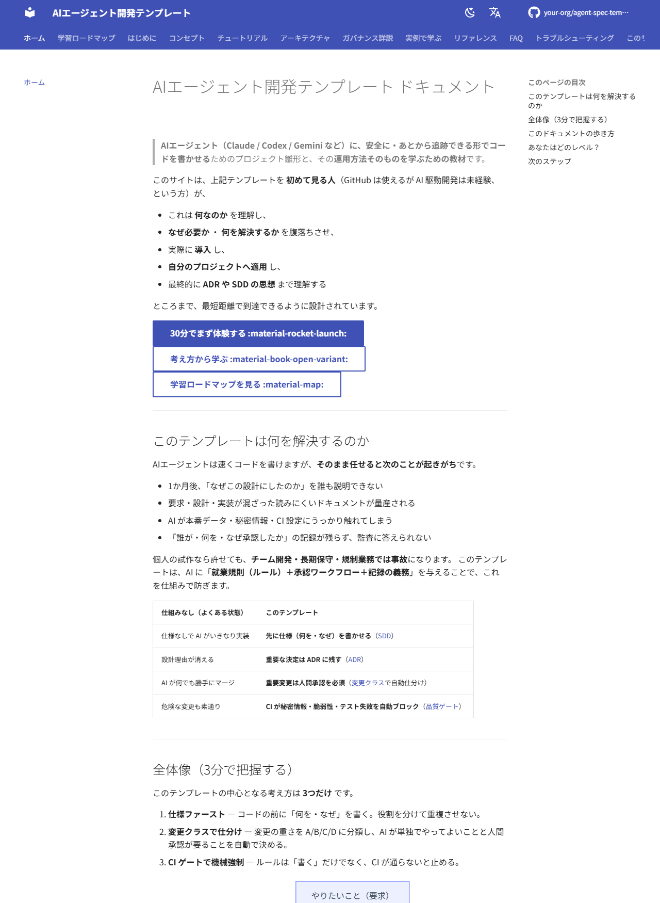

# AIエージェント開発テンプレート（AIDD × SDD）

> **AIエージェント（Claude / Codex / Gemini 等）に、安全に・あとから追跡できる形でコードを書かせるためのプロジェクト雛形です。**  
> 「何を作るか」と「なぜそう決めたか」をAIに必ず記録させ、危険な操作だけ人間の承認を必須にします。  
> これにより、AIの開発スピードと、チーム開発・長期保守・監査に耐える安全性を両立します。

*このリポジトリは「開発の進め方」の雛形であり、実行されるアプリのコードは含みません（あなたのコードを足して使います）。現在 `v0.1.0` ドラフト。*

> **🚀 すぐ使う**: GitHub の **「Use this template」** ボタンで複製 → [ADOPTION.md](ADOPTION.md) で初期設定 → 下の「[クイックスタート](#クイックスタート)」で最初の機能を作成。

> **📖 学習用ドキュメント**: 入門者・初学者向けの公式ドキュメントサイトを [docs/](docs/index.md) に用意しています（MkDocs Material 製）。
> コンセプト・チュートリアル・FAQ・用語集まで、AI駆動開発が初めてでもゼロから学べます。
> ローカル表示は `mkdocs serve`、GitHub Pages 公開後は `https://makinoh.github.io/agent-spec-template/` で閲覧できます（公開手順は [docs/about/site-design.md](docs/about/site-design.md)）。

[](docs/index.md)

---

## ⏱️ 5分で把握する（まず読む順番）

フォルダは多いですが、**最初に見るのは次の4つだけ**で十分です。

| 順 | 見るもの | これは何か |
| --- | --- | --- |
| 1 | このREADME | 全体像（いま読んでいるもの） |
| 2 | [AGENTS.md](AGENTS.md) | **AIエージェントの入口**。ルールの要約と「どの文書を見るか」 |
| 3 | [development-process.md](development-process.md) | 変更の進め方・承認の要否・開発コマンドの流れ |
| 4 | [specs/001-user-profile-export/](specs/001-user-profile-export/) | 1機能を spec→plan→tasks で書いた**実例** |

> ルールの全文は [constitution.md](constitution.md)（長め）。急ぐなら簡潔版 [.specify/memory/constitution.md](.specify/memory/constitution.md) を。

---

## このプロジェクトが解決する問題

AIエージェントは速くコードを書けますが、**そのまま任せると次のことが起きがち**です。

- 1か月後、「なぜこの設計にしたのか」を誰も説明できない
- 要求・設計・実装が混ざった読みにくいドキュメントが量産される
- AIが本番データ・秘密情報・CI設定にうっかり触れてしまう
- 「誰が・何を・なぜ承認したか」の記録が残らず、監査に答えられない

個人の試作なら許せても、**チーム開発・長期保守・規制のある業務では事故**になります。

このテンプレートは、AIに「就業規則（ルール）＋承認ワークフロー＋記録の義務」を与えることで、この問題を仕組みで防ぎます。

| 仕組みなし（よくある状態） | このテンプレート |
| --- | --- |
| 仕様なしでAIがいきなり実装 | **先に仕様（何を・なぜ）を書かせる** |
| 設計理由が消える | **重要な決定は ADR（設計判断の記録）に残す** |
| AIが何でも勝手にマージ | **重要変更は人間承認を必須**（変更クラスで自動仕分け） |
| 危険な変更も素通り | **CIが秘密情報・脆弱性・テスト失敗を自動ブロック**（コード追加時に活性化） |

---

## このプロジェクトでできること

- Claude / Codex / Gemini など**複数のAIツールに、同じルールで開発させる**（ルールは1か所＝ AGENTS.md）
- AIに**仕様・設計・ADR・テスト・実装を下書きさせ、人間はレビューと承認に集中する**
- 次のような危険を **CIで機械的にブロック**する
  - 秘密情報（APIキー等）のコード混入
  - 既知の重大な脆弱性を含む依存
  - テスト・型チェックの失敗（採用スタックを検出した場合に活性化。カバレッジ閾値の強制は採用組織が配線）
  - 重要変更なのに設計理由（ADR）が書かれていないPR
  - 統治・CI設定への無断変更
- **すべての重要な決定が記録され、検索・監査できる**状態を保つ

このテンプレートが必ず守らせること（抜粋）：

- 本番の個人情報・機密・秘密情報を AI／外部AIに渡さない
- 変更の作成者と承認者を分ける（AIは自分の権限を勝手に広げられない）
- 品質ゲートを通らない変更は、保護ブランチにマージできない

---

## 想定ユーザー・利用シーン

**こんな人・チーム向けです。**

- AI主体で開発しつつ、**設計根拠や承認の記録**を残したいチーム
- **Claude / Codex / Gemini などを併用**していて、ルールを統一したい人
- 受託開発・規制業界など、**監査やコンプライアンスの説明責任**がある現場
- 個人開発でも、**3か月後の自分のため**に決定を残したい人

**具体的な利用シーン例**

- 受託案件で、AIが書いたコードの設計理由を顧客監査に提示したい
- 規制業界で、「AIは本番データに触れない」ことを構造的に保証したい
- 大規模リポジトリで、AIの自律範囲と人間の承認境界を明確にしたい

> AIエージェント開発やガバナンスに詳しくなくても使えます。専門用語はその都度説明します。

---

## アーキテクチャ概要

中心となる考え方は **3つだけ**です。

1. **仕様ファースト** — コードの前に「何を・なぜ」を書く。役割を分けて重複させない。
   - `spec`＝何を作るか / `plan`＝どう作るか / `ADR`＝なぜこの設計にしたか
2. **変更クラスで仕分け** — 変更の重さを A/B/C/D に分類し、AIが単独でやってよいことと人間承認が要ることを自動で決める。
3. **CIゲートで機械強制** — ルールは「書く」だけでなく、CIが**通らないと止める**。

開発の流れ（spec-kit のコマンドに対応）:

```text
   要求（やりたいこと）
        │
        ▼
  spec   「何を・なぜ」        ← /speckit.specify
  plan   「どう作るか」        ← /speckit.plan（重要な決定は ADR に記録）
  tasks  「作業の分解」        ← /speckit.tasks
  実装    コード ＋ テスト      ← /speckit.implement
        │
        ▼
  CI 品質ゲート：秘密情報・脆弱性・テスト・ADR記載 を自動チェック
        │
        ▼
  人間レビュー → 保護ブランチへマージ（重要変更は承認が必須）
```

「誰が何をしてよいか」を決める**変更クラス**（詳細は [development-process.md](development-process.md)）:

| クラス | 例 | AIの権限 | マージ |
| --- | --- | --- | --- |
| **A** | 統治ルール・セキュリティ・本番データ・不可逆操作 | 下書きのみ | 人間承認＋専任レビュア必須 |
| **B** | アーキテクチャ・公開API | 下書き（ADR起票を含む） | 人間承認＋ADR必須 |
| **C** | 通常の機能追加・バグ修正 | 下書き・実装まで | 人間がマージ承認 |
| **D** | ドキュメント・整形 | 下書き＋自己反映可※ | 品質ゲート通過時 |

※統治文書を除く。迷ったら**最も厳しい Class A 扱い**にするのが既定動作です。

---

## ディレクトリ構成

> **太字＝まず見るもの。** それ以外は「必要になったら見る参照資料」です。

### ルール・統治（最初に読む）

```text
AGENTS.md                AIエージェント実行指示の入口（★ここから）
constitution.md          開発憲章（最上位ルール）
 └ .specify/memory/constitution.md   その簡潔版（ゲート判定用）
development-process.md    変更クラス・承認・開発コマンドの流れ
CLAUDE.md / GEMINI.md / CODEX.md / OPENHANDS.md / TAKT.md   各AIツール向けの薄い設定（中身は AGENTS.md に委譲）
agents/                  エージェント名簿・マルチエージェント協調プロトコル
standards/               セキュリティ・テスト等の技術標準
governance/              ルール改正の記録・強制台帳・例外/適用除外/リスク台帳
```

### 作業する場所

```text
specs/                   機能ごとの spec / plan / tasks（サンプル実例: 001, 002 ＝採用時に置換）
adr/                     設計判断の記録（ADR）＋ 自動生成の索引
architecture/            アーキテクチャ・リポジトリ（原則・境界・ケイパビリティ・C4・ドメイン・連携・ロードマップ）
```

### AIの知識・手順（任意・育てていく）

```text
knowledge/               AIに参照させるドメイン知識（確定）
memory/                  エージェント作業記憶（申し送り・反省・却下案。確定後は昇格）
playbooks/               運用手順（リリース・障害対応 等）
prompts/                 再利用するプロンプト資産（ライフサイクル統治）
skills/                  手順化した能力（SKILLS.md の実体）
metrics/                 計測（DORA・AI 有効性）
```

### 設定・運用

```text
ADOPTION.md              採用時のセットアップ手順
.github/                 CI（品質ゲート）と CODEOWNERS（必須レビュア）
adr-rules.md / adr-template*.md   ADRの書式ルールと雛形
glossary.md              用語集
```

---

## クイックスタート

このテンプレートを**自分のプロジェクトに採用する**手順です。

1. このリポジトリを複製する（GitHub の **Use this template**、またはクローン）
2. spec-kit を導入する（`/speckit.*` コマンドを使えるAIエージェント環境）
3. [ADOPTION.md](ADOPTION.md) に沿って初期設定する
   - [charter.md](charter.md) / [scope.md](scope.md) にプロジェクトの目的・範囲を書く
   - `.github/` の CI を有効化し、ブランチ保護を設定する
4. 最初の機能を作る（AIエージェントに以下を指示）

```text
/speckit.specify   # 何を・なぜ作るか（spec）
/speckit.plan      # どう作るか（plan）＋ 重要なら ADR
/speckit.tasks     # 実行可能なタスクに分解
/speckit.implement # 実装（テスト含む）
```

> まず動きを見たいだけなら、[specs/001-user-profile-export/](specs/001-user-profile-export/) と [adr/](adr/) を眺めるのが一番の近道です（記入済みの実例）。

---

## 開発フロー

役割分担はシンプルです。**AIが下書きし、人間が承認する。**

```text
AIエージェント                      人間
─────────────                     ───────────
spec / plan / ADR の草案     →     レビュー・修正依頼
テスト・実装（Class C/D）     →     保護ブランチへのマージを承認
                                   （Class A/B は承認が必須）
        │
        ▼
   CI 品質ゲート（秘密情報・脆弱性・テスト・ADR記載 を自動チェック）
```

- 仕様と実装がずれたら、**実装を直すか仕様を更新する**（どちらかは人間が判断）
- 重要な設計判断は **ADR に「採用案・却下案・理由」を残す**（[adr/](adr/) に実例）
- ドキュメントだけの修正は、品質ゲートを通れば AI が自分で反映できる（統治文書を除く）

---

## 品質ゲート（Local = AI = CI）

品質チェックは **`task verify` に一元化**しています（Single Source of Truth）。開発者・AIエージェント・CI が同じコマンドを実行します。

| タイミング | コマンド | 内容 |
| --- | --- | --- |
| コミット前 | `task verify:fast` | 高速（構造・ADR命名・front matter・markdown） |
| Push前 / PR / CI | `task verify` | 包括（＋ADR索引・リンク・秘密情報・依存脆弱性・build） |

```text
task setup    # ツール導入（mise / .mise.toml）
task hooks    # git hook 有効化（lefthook）— commit/push 時に自動実行
task verify   # 全チェック（CI と同一）
task fix      # markdownlint --fix ＋ ADR 索引再生成
task doctor   # 利用可能なツールを表示
```

- Git hook は **lefthook**（`.git/hooks` を直接使わず `lefthook.yml` を版管理）。
- CI（`.github/workflows/verify.yml`）は独自ロジックを持たず `task verify` を実行。
- ブランチ保護で **verify** を Required Status Check に登録してください（[ADOPTION.md](ADOPTION.md)）。

---

## よくある質問（FAQ）

**Q. これはフレームワークやライブラリですか?**  
A. いいえ。実行コードを含まない「開発プロセスの雛形」です。あなたのアプリのコードを足して使います。

**Q. 特定のAIツール専用ですか?**  
A. いいえ。[AGENTS.md](AGENTS.md) を共通ルールとして、Claude Code / Codex / Gemini CLI / OpenHands / Takt などで共有できます。ツール固有ファイル（CLAUDE.md 等）は薄い設定だけです。

**Q. 対応する言語・スタックは?**  
A. 不問です。CI は Node / Python / Go / Java を自動検出します。コードが無い段階でもCIはグリーンで通り、コードを足すと品質チェックが自動で有効になります。

**Q. AIが勝手に `main` にマージしますか?**  
A. しません。保護ブランチへの反映は人間承認が必須です（軽微なドキュメント変更を除く）。AIは自分が関わった権限拡大を承認できません。

**Q. 小規模・個人開発には重すぎませんか?**  
A. 必要な分だけ採用できます。[development-process.md](development-process.md)「8. 段階導入」で軽く始め、後から強化できます。ただし絶対ルール（本番データをAIに渡さない 等）は常に有効です。

**Q. ADR とは何ですか?**  
A. **Architecture Decision Record＝「なぜこの設計にしたか」を1ファイルに残す記録**です。後から決定理由をたどれます。[adr/](adr/) に実例があります。

**Q. GitHub は必須ですか?**  
A. CI は GitHub Actions を前提にしていますが、考え方は他のCIにも移植できます。設定手順は [ADOPTION.md](ADOPTION.md)。

**Q. `specs/001`・`002` は本物の機能ですか?**  
A. いいえ。GDPR のエクスポート／削除を題材にした**サンプル**です。書き方の手本として残し、実プロジェクトでは置き換えます。

---

## 詳細ドキュメントへのリンク

よく使う文書:

- [AGENTS.md](AGENTS.md) — AIエージェント実行指示の入口
- [constitution.md](constitution.md) — 開発憲章（最上位ルール） / 簡潔版: [.specify/memory/constitution.md](.specify/memory/constitution.md)
- [development-process.md](development-process.md) — 変更クラス・承認・開発フロー・段階導入
- [ADOPTION.md](ADOPTION.md) — 採用セットアップ手順
- [adr-rules.md](adr-rules.md) — ADR の書き方 / 雛形: [adr-template.md](adr-template.md)・[adr-template-minimal.md](adr-template-minimal.md)
- [standards/](standards/) — セキュリティ・テスト等の技術標準

<details>
<summary>全文書マップ（必要になったら開く）</summary>

| 文書 | 役割 |
| --- | --- |
| [constitution.md](constitution.md) | 開発憲章（最上位ルール） |
| [.specify/memory/constitution.md](.specify/memory/constitution.md) | 憲章の簡潔版（spec-kit のゲート判定用） |
| [AGENTS.md](AGENTS.md) | AIエージェント実行指示の入口 |
| [CLAUDE.md](CLAUDE.md) / [GEMINI.md](GEMINI.md) / [CODEX.md](CODEX.md) / [OPENHANDS.md](OPENHANDS.md) / [TAKT.md](TAKT.md) | 各AIツール向けの薄い委譲設定 |
| [agents/](agents/) | エージェント名簿・マルチエージェント協調プロトコル |
| [SKILLS.md](SKILLS.md) | エージェント能力カタログ（→ `skills/`） |
| [development-process.md](development-process.md) | 変更クラス・承認・spec-kit 写像・段階導入 |
| [adr-rules.md](adr-rules.md) | ADR 運用規則（命名・必須項目・ステータス） |
| [adr-template.md](adr-template.md) / [adr-template-minimal.md](adr-template-minimal.md) | ADR 記入様式（完全 / 最小） |
| [adr/](adr/) | 個別のADRと自動生成索引 |
| [architecture/](architecture/) | アーキテクチャ原則・境界 |
| [standards/](standards/) | 横断技術標準（security / testing / ai-governance 等） |
| [knowledge/](knowledge/) | AI参照用の永続知識（確定） |
| [memory/](memory/) | エージェント作業記憶（非規範。確定後は昇格） |
| [playbooks/](playbooks/) | 再利用可能なタスク手順 |
| [prompts/](prompts/) | レビュー対象のプロンプト資産（ライフサイクル統治） |
| [glossary.md](glossary.md) | 用語集（ドメイン用語） |
| [governance/](governance/) | ルール改正の記録・強制台帳・例外/適用除外/リスク台帳 |
| [metrics/](metrics/) | 計測（DORA・AI 有効性指標） |
| [ADOPTION.md](ADOPTION.md) | 採用セットアップ手順 |
| [.specify/templates/](.specify/templates/) | spec / plan / tasks のテンプレート |
| [specs/](specs/) | 機能単位の spec / plan / tasks |

文書間の優先順位は [constitution.md「2. 文書管理階層」](constitution.md) を正本とします。

</details>

---

## ライセンス

[MIT License](LICENSE) © 2026 Hiroyuki Makino

## 貢献・セキュリティ

- 貢献方法: [CONTRIBUTING.md](CONTRIBUTING.md)
- 脆弱性の報告: [SECURITY.md](SECURITY.md)（公開 Issue にしない）
- テンプレート採用時の初期設定: [ADOPTION.md](ADOPTION.md)

---

*ステータス: 統治文書は `v0.1.0`（Proposed / ドラフト）。正式批准時に `v1.0.0` とします（[constitution.md「7. 変更管理」](constitution.md)）。*
