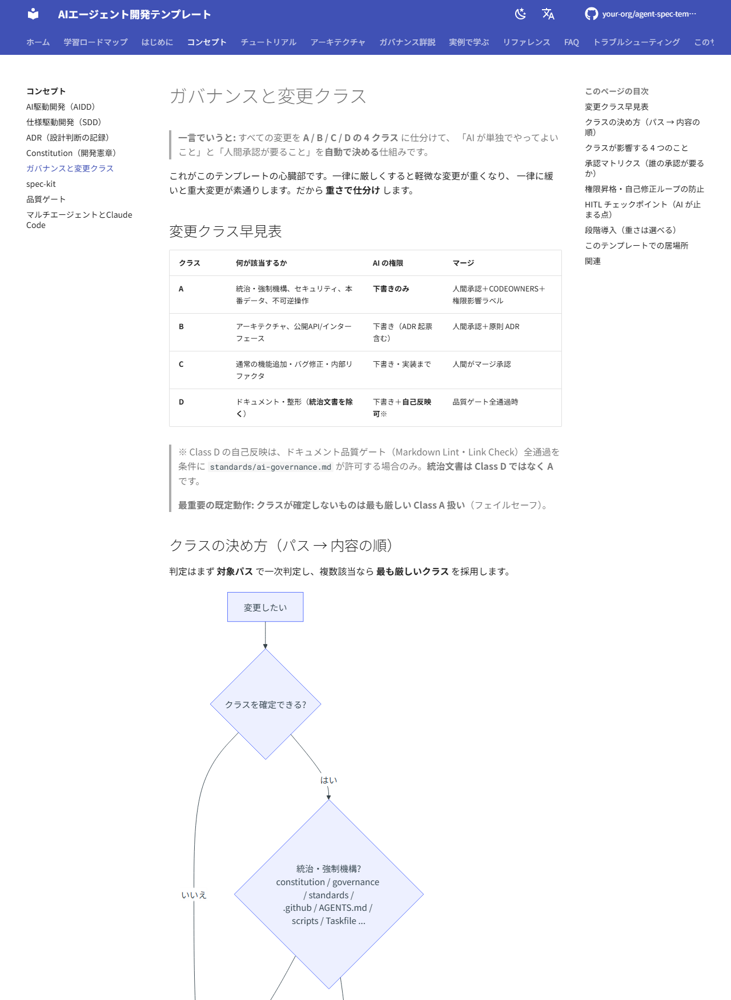

# このサイトについて（設計と自己レビュー）

このページは、本ドキュメントサイト**そのものの設計**を開示するメタページです。
ビルド方法・技術選定の理由・SEO・**ガバナンス上の扱い**・品質の自己レビューをまとめます。

## サイトの外観

ホーム（日本語・ライトテーマ）。ヘッダに検索・GitHub リンク・言語スイッチャを備えます。


コンセプト「ガバナンスと変更クラス」。本サイトは要所で **Mermaid 図**（下はクラス判定フロー）と表を用いて図解します。



## ビルドと公開

| 操作 | コマンド |
| --- | --- |
| 依存導入 | `pip install -r requirements-docs.txt` |
| ローカル確認 | `mkdocs serve` |
| 本番ビルド | `mkdocs build --strict` |
| 公開 | `.github/workflows/deploy-docs.yml`（GitHub Actions → Pages） |

> **公開先:** GitHub ユーザー `makinoh` のプロジェクトサイト（`https://makinoh.github.io/agent-spec-template/`）。
> フォークして別アカウント/別リポジトリ名で公開する場合は `mkdocs.yml` の `site_url` / `repo_url` / `repo_name` を置換します。
> GitHub の Settings → Pages → Source を **GitHub Actions** に設定して初めて公開されます。

## 技術選定 — なぜ MkDocs Material か

候補を、本テンプレートの性質（Markdown 中心・AI 駆動・GitHub Pages・低学習コスト）に照らして比較しました。

| 評価軸 | MkDocs Material | Docusaurus | Astro Starlight | VitePress |
| --- | --- | --- | --- | --- |
| AI 駆動開発との相性 | ◎ 純 Markdown ＋ 単一 YAML 設定で AI が編集しやすい | △ MDX/React で複雑 | ○ MDX/コンポーネント | ○ Vue/MD |
| Markdown 中心運用 | ◎ ほぼ素の Markdown | △ MDX 寄り | ○ | ○ |
| GitHub Pages 適性 | ◎ `mkdocs gh-deploy`／Actions が定番 | ○ | ○ | ○ |
| 保守性 | ◎ Python 単一・依存が少ない | △ Node 依存が厚い | ○ | ○ |
| 学習コスト | ◎ 低い | △ React 知識 | ○ | ○（Vue 寄り） |
| 将来性 | ◎ 巨大エコシステム・活発 | ◎ | ○（新興・成長中） | ○ |
| 日本語・検索 | ◎ `search.lang: ja` | ○ | ○ | ○ |
| 図（Mermaid） | ◎ superfences で標準的 | ○ | ○ | ○ |

**結論: MkDocs Material を採用。** 理由は、

1. 本テンプレートは **Markdown が中心**で、AI エージェントが設定・本文を編集します。**純 Markdown ＋ 単一 `mkdocs.yml`** は AI にとって最も扱いやすく、Node ビルド・MDX/JSX の複雑さがありません。
2. 既存リポジトリが **Python ツール（`scripts/`・`.mise.toml`）** を使っており、Python 製の MkDocs は**ツールチェーンが一貫**します。
3. GitHub Pages への公開が容易で、**学習コストが低く保守が軽い**——「教材」が陳腐化しにくい。
4. Mermaid・日本語検索・ダークモード・編集リンクなど、教育サイトに必要な機能が**標準でそろう**。

> Docusaurus/Starlight/VitePress も優秀ですが、いずれも **Node ＋ コンポーネント指向**で、
> 「Markdown を AI に編集させ続ける教材」という本件の要件では MkDocs Material が最も摩擦が小さいと判断しました。

## 情報アーキテクチャ（IA）

学習順序（前提知識の少ない順 → 手を動かす → 思想理解）を軸に、次の最上位構成にしています。

```text
ホーム → 学習ロードマップ → はじめに → コンセプト → チュートリアル
       → アーキテクチャ → ガバナンス詳説 → 実例で学ぶ
       → リファレンス（用語集/文書マップ/コマンド集）→ FAQ → トラブルシューティング
```

- **READ ME の分割ではなく、学習導線として再設計**。Day 1〜3 の[ロードマップ](../learning-path.md)が背骨。
- **概念（なぜ）と実践（どうやって）を分離**。コンセプトとチュートリアルが対をなす。
- **参照資料（用語集・文書マップ・コマンド・FAQ・トラブル）を独立**させ、通読不要に。

## SEO 設計

| 項目 | 方針 |
| --- | --- |
| `title` | 各ページ frontmatter の `title`。サイト名と組み合わさる（例:「ADR（設計判断の記録） - AIエージェント開発テンプレート」） |
| `description` | 各ページ frontmatter の `description`（120〜160字目安、検索スニペット用） |
| `keywords` | 主要語: AI駆動開発, AIDD, 仕様駆動開発, SDD, ADR, Architecture Decision Record, Constitution, ガバナンス, spec-kit, Claude Code, MkDocs |
| `site_url` | 正規 URL を設定（sitemap.xml 自動生成・canonical 付与） |
| 言語 | `lang: ja`（適切な言語メタ） |
| 構造 | 1 ページ 1 H1、見出し階層を厳守（Lint で担保） |
| 内部リンク | 関連ページを相互リンクし回遊性とクロールを向上 |
| ソーシャル | 必要なら Material の social cards プラグインで OGP 画像を自動生成（任意・要追加依存） |

> 各ページの `description` は本サイト全ページに記入済みです（検索結果のスニペット最適化）。

## 図解一覧（Mermaid）

教材性を高めるため、要所に Mermaid 図を配置しています。

| 図 | 場所 |
| --- | --- |
| 全体アーキテクチャ（レイヤ） | [アーキテクチャ](../architecture/index.md) |
| 開発フロー（spec→plan→tasks→実装→ゲート→承認） | [ホーム](../index.md)・[最初の機能](../getting-started/first-feature.md) |
| ADR ライフサイクル（Status 遷移） | [ADR](../concepts/adr.md) |
| 仕様（spec）ライフサイクル | [SDD](../concepts/spec-driven-development.md) |
| ガバナンスフロー（クラス判定・承認） | [ガバナンス](../concepts/governance.md) |
| 強制手段の三分類 | [Constitution](../concepts/constitution.md) |
| 自己修正ループの防止 | [ガバナンス](../concepts/governance.md) |
| マルチエージェント委譲構造 | [マルチエージェント](../concepts/multi-agent.md) |
| 学習ロードマップ | [学習ロードマップ](../learning-path.md) |

## ガバナンス上の開示（重要）

本サイトをテンプレートへ追加する変更は、**このテンプレート自身のガバナンスに従います**。変更クラスは次の通り。

| 追加物 | 変更クラス | 扱い |
| --- | --- | --- |
| `docs/**`（本文） | **D** | 文書。AI 起案可。ドキュメントゲート通過で自己反映可 |
| `mkdocs.yml` / `requirements-docs.txt` | C 相当 | ビルド設定（ゲートの実体ではない） |
| `.gitignore`（`site/` 追記） | D | 整形 |
| `.github/workflows/deploy-docs.yml` | **A** | `.github/**` に属する**統治・強制機構**。人間承認＋CODEOWNERS＋`permission-impact` ラベル必須 |

> **開示:** 上記 **Class A（デプロイワークフロー）は AI が「起案」したドラフト**です。
> 作成者≠承認者の原則により、**人間のレビューと承認なしにマージしてはいけません**。
> また、品質ゲートを弱めないため `.markdownlint.jsonc` 等は変更せず、本サイトの Markdown は
> 既存の Lint 設定に**適合する形で記述**しています（admonition ではなく blockquote を採用、等）。

これ自体が「[変更クラス](../concepts/governance.md)による仕分け」の実例になっています。

## 品質の自己レビュー — このサイトだけで実運用可能か

> **問い:** このサイトだけを読んだ初学者が、実運用可能になるか？

**おおむね可能**と評価します。理由と、残る不足・改善案を率直に記します。

### 満たせていること

- **概念（なぜ）→ 実践（どうやって）→ 参照** の学習導線が通っている。
- spec / ADR / Constitution / ガバナンス / 品質ゲートを、図と実例で一通り説明している。
- **30分で成果**（[クイックスタート](../getting-started/quickstart.md)）と、作成→運用までの**6 チュートリアル**がある。
- FAQ 56 件・トラブルシューティング 32 件で、導入時のつまずきを広くカバー。
- 用語集・文書マップ・コマンド集で、自走に必要な参照がそろう。
- 日本語が正本。ヘッダに**英語の言語スイッチャ**を備え、主要ランディング（ホーム・はじめに・コンセプト）とナビは英訳済み（未翻訳ページは日本語にフォールバック）。

### 残る不足と改善案

| 不足 | 影響 | 改善案 |
| --- | --- | --- |
| `site_url` / `repo_url` がプレースホルダ | 公開・内部リンク・SEO に要設定 | 採用時に実値へ置換（本ページ冒頭に明記済み） |
| 実リポジトリのソースへの直リンクが無い | 「実物を見る」導線が弱い | `repo_url` 確定後、各所に GitHub 上のファイルへのリンクを追加 |
| 操作動画/GIF が無い | 動的な操作の手応えは弱い | サイト外観のスクリーンショットは掲載済み（上記「サイトの外観」）。チュートリアルに操作 GIF/動画を順次追加 |
| spec-kit の具体的導入コマンドは外部参照 | バージョンで変わるため | 上流に追従。必要なら採用組織の手順を `playbooks/` 化 |
| コード例が言語非依存の擬似例 | 実行はできない | 採用スタックでの runnable なサンプルアプリを別途用意 |
| 英語版（i18n）は主要ページのみ | 深いページは ja フォールバック | `mkdocs-static-i18n` を導入済み。home・getting-started・concepts のランディングとナビを英訳済み。残りは `<name>.en.md` を追加するだけで順次英語化できる |
| ソーシャル OGP 画像が未設定 | SNS 共有時の見栄え | Material の social プラグイン（要追加依存）を有効化 |
| 最終更新日の表示が未設定 | 鮮度が分かりにくい | `git-revision-date-localized` プラグインを有効化 |

> **総評:** 「読んで理解し、最初の機能を作り、レビューしてマージし、運用に入る」までは本サイトだけで到達できます。
> 一方、**公開のためのプレースホルダ置換**と **Class A ワークフローの人間承認**は、サイト外の作業として必ず残ります（これは仕様です）。

## 関連

- 学習の入口: [学習ロードマップ](../learning-path.md)
- 統治の考え方: [ガバナンスと変更クラス](../concepts/governance.md)
- 文書全体像: [文書マップ](../reference/document-map.md)
