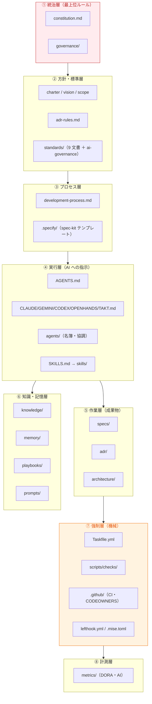

# アーキテクチャ

このページは、テンプレート **そのものの構造**（どの文書が何を担うか）の地図です。
「[文書マップ](../reference/document-map.md)」が一覧なら、こちらは**レイヤ構造**で見る視点です。

## 全体アーキテクチャ（レイヤで見る）



## 各レイヤの役割

| レイヤ | 何を担うか | 主なファイル |
| --- | --- | --- |
| ① 統治 | 変わりにくい最上位ルールと改正記録 | `constitution.md`、`governance/` |
| ② 方針・標準 | 目的・スコープ・ADR規則・技術標準 | `charter/vision/scope`、`adr-rules.md`、`standards/` |
| ③ プロセス | 変更クラス判定・spec-kit 写像 | `development-process.md`、`.specify/` |
| ④ 実行 | AI への実行指示・名簿・能力 | `AGENTS.md`、各ツール設定、`agents/`、`SKILLS.md` |
| ⑤ 作業 | 機能の仕様・設計判断・設計 | `specs/`、`adr/`、`architecture/` |
| ⑥ 知識・記憶 | ドメイン知識・手順・記憶・プロンプト | `knowledge/`、`memory/`、`playbooks/`、`prompts/` |
| ⑦ 強制 | 品質ゲートの機械強制 | `Taskfile.yml`、`scripts/`、`.github/`、`lefthook`/`mise` |
| ⑧ 計測 | 開発の健全性の観測 | `metrics/` |

## `architecture/` ディレクトリ（あなたのアプリの設計の置き場）

テンプレート同梱の `architecture/` は、**あなたが作るアプリ**のアーキテクチャを記述する場所です。

| サブディレクトリ | 用途 |
| --- | --- |
| `architecture/principles.md` | 設計原則（疎結合・依存方向・境界の規律） |
| `architecture/boundaries.md` | アーキテクチャ境界（レイヤ・モジュール依存規則） |
| `architecture/capabilities/` | ケイパビリティ（提供能力）の地図 |
| `architecture/context-maps/` | コンテキストマップ（DDD の境界づけ） |
| `architecture/domain-models/` | ドメインモデル |
| `architecture/roadmaps/` | アーキテクチャのロードマップ |

> 設計の **理由** は ADR、設計の **内容** は `architecture/` と `standards/architecture-standards.md`。
> 役割を分けて重複させません（SSoT）。

## `standards/`（横断技術標準）

プロジェクト横断で効く技術標準です。ADR・憲章と矛盾してはいけません。

```text
standards/
├─ coding-standards.md          api-standards.md
├─ architecture-standards.md    security-standards.md
├─ testing-standards.md         observability-standards.md
├─ performance-standards.md     accessibility-standards.md
└─ ai-governance.md             ← AI 運用の詳細方針（憲章と AGENTS.md の中間層）
```

## あなたのアプリのコードはどこへ？

テンプレートは**実行コードを含みません**。採用後、あなたのコードを足します（例: `src/`、`tests/`）。
コードを足すと、品質ゲート（build/test/型/カバレッジ）が**自動で有効化**されます。

## 関連

- 一覧で見る: [文書マップ](../reference/document-map.md)
- 統治の深掘り: [ガバナンス詳説](../governance/index.md)
- 機械強制: [品質ゲート](../concepts/quality-gates.md)
