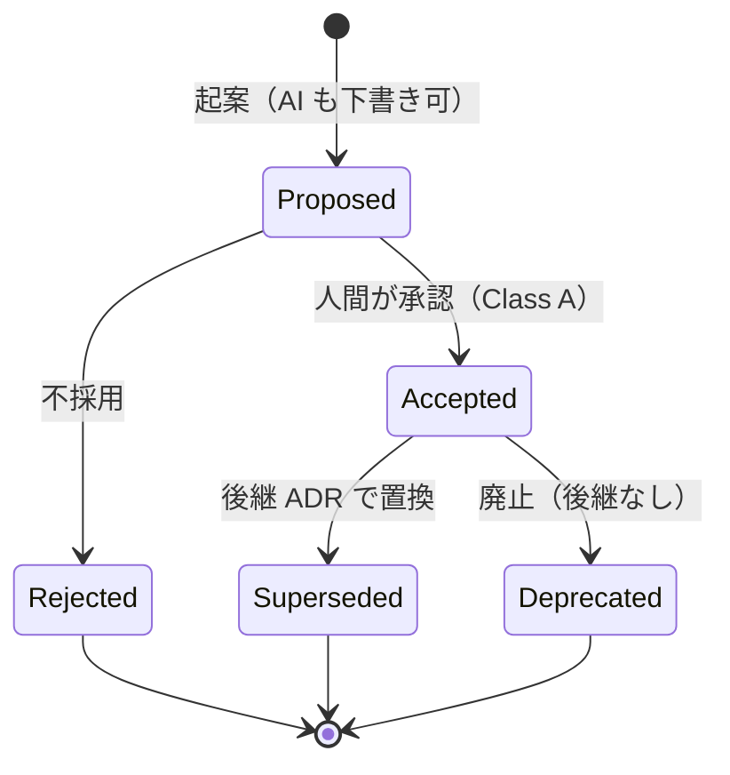
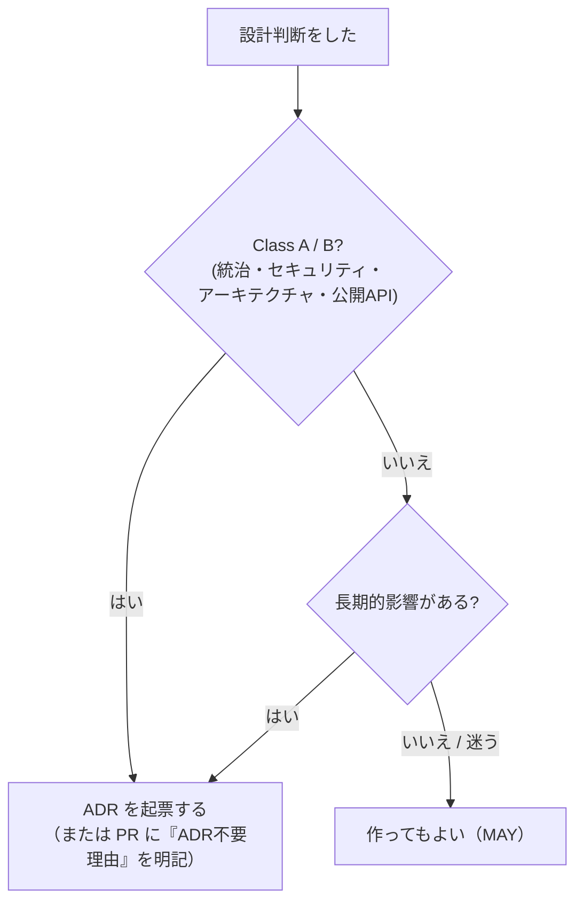

# ADR（設計判断の記録）

> **一言でいうと:** 「**なぜこの設計にしたか**」を 1 ファイルに残す記録です。
> ADR = **Architecture Decision Record**（アーキテクチャ決定記録）。
> 採用案だけでなく **却下案とその理由** も残すのが肝心です。

## なぜ ADR が必要か

設計判断の理由は、議事録・チャット・口頭・人の記憶に散らばりがちです。すると:

- 半年後、「なぜ MySQL ではなく PostgreSQL にしたのか」を誰も説明できない
- 同じ議論を何度も蒸し返す
- 監査や引き継ぎで「決定の根拠」を示せない

ADR は、こうした**決定知識の散逸**を防ぎます。AI 駆動開発では特に重要です。
AI は速く設計を変えられるため、**理由を構造化して残さないと、設計意図が一瞬で失われる**からです。

## spec と ADR はどう違う？

| | spec | ADR |
| --- | --- | --- |
| 答える問い | **何を**作るか（What/Why） | **なぜこの設計**か（Why-this-design） |
| 例 | 「ユーザーが自分のデータをエクスポートできる」 | 「エクスポート形式に JSON+CSV を選んだ理由・却下した代替」 |
| 正本 | `specs/<feature>/spec.md` | `adr/adr-NNNN-*.md` |

両者は**補完関係**で、重複させません。

## ADR のライフサイクル（Status 遷移）

ADR は `status` を持ち、決められた遷移しかできません。これにより決定の系譜を追跡できます。



> **重要な不変性ルール:** **Accepted になった ADR の本文は実質的に変更しません。**
> 内容を変えたいときは、新しい ADR を起案して古いものを **Superseded**（置換済み）にします。
> これにより「決定の歴史」が改ざんされず、監査証跡になります（誤記修正など軽微な変更は変更履歴に記録した上で可）。

## ADR の中身（構造）

ADR は **機械可読メタデータ（フロントマター）** と **本文セクション** からなります。
メタデータはフロントマターを唯一の正本とし、本文に二重記載しません（SSoT）。

```yaml
---
id: ADR-0001
title: データベースの選定
status: proposed        # proposed | accepted | rejected | deprecated | superseded
date: 2026-04-01
profile: full           # minimal | full
scope: project          # organization | division | department | product | project
decision-makers: []
review_after: ""
superseded_by: []
relates_to: []
---
```

本文の必須セクション（両プロファイル共通）:

- タイトル（`ADR-NNNN: 決定の短い表題`）
- 変更履歴 / コンテキスト / 意思決定事項 / 選択肢 / 決定（案）/ 承認 / 結果

**プロファイル**は 2 種類:

| プロファイル | いつ使う | 様式 |
| --- | --- | --- |
| **minimal** | プロジェクト/小規模、軽い決定 | `adr-template-minimal.md` |
| **full** | 組織・Class A 相当・監査要件が強い・定量比較が要る | `adr-template.md` |

## 命名規則と索引

- ファイル名は `adr-NNNN-short-title.md`（`NNNN` は 4 桁ゼロ埋め連番、`0000` は予約）。
- 番号は再利用しない。不採用・廃止も**削除せず Status で表現**する。
- `adr/INDEX.md` は **フロントマターから自動生成** される索引（手で編集しない）。
  生成は `python scripts/generate_adr_index.py`、CI は再生成して差分ゼロを検証します。

## ADR はいつ必要か



CI は「**重大変更（Class A/B）の PR に ADR 参照または不要理由が書かれているか**」を機械チェックします。
これにより「ADR を書かなかったこと」を検知できます。

## このテンプレートでの居場所

| 何 | どこ |
| --- | --- |
| ADR ポリシー（要否） | `constitution.md`「5. ADRポリシー」 |
| ADR 運用規則（命名・必須・Status） | `adr-rules.md` |
| 記入様式 | `adr-template.md` / `adr-template-minimal.md` |
| 実例（ADR 運用自体の決定） | `adr/adr-0000-adr-format-and-governance.md` |
| 自動索引 | `adr/INDEX.md` |

## よくある誤解

- 「ADR = テンプレート」ではありません。ADR は **個別の決定**。様式が `adr-template.md`。
- 「Accepted を後で書き換える」のは禁止。**新 ADR で Superseded** にします。
- 「メタデータを本文にも書く」のは二重管理。**フロントマターが唯一の正本**です。

## 関連

- 手を動かす: [チュートリアル2「ADRを作成する」](../tutorials/02-write-adr.md)
- 上位ルール: [Constitution](constitution.md)
- 何を作るか側: [仕様駆動開発（SDD）](spec-driven-development.md)
