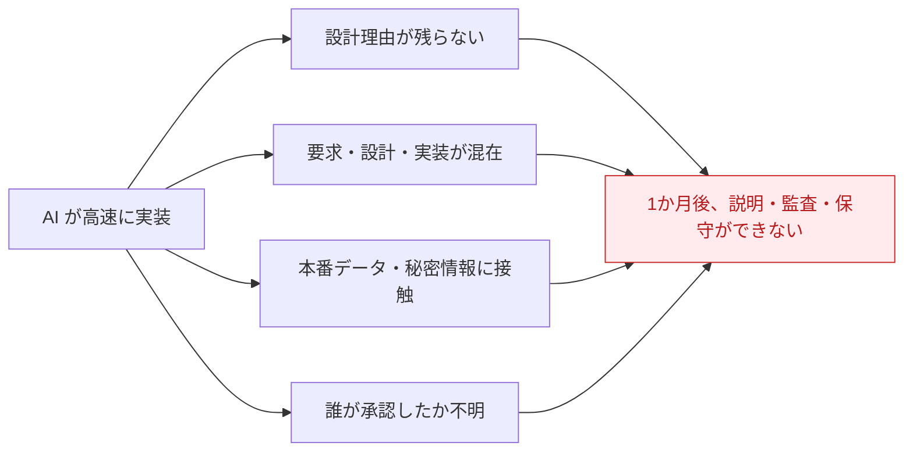
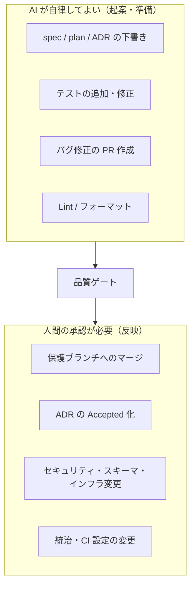

# AI駆動開発（AIDD）

> **一言でいうと:** AI エージェントを「使い捨ての道具」ではなく **「継続的な開発メンバー」** として扱い、
> 人間と同じ判断根拠（ルール・設計記録）にアクセスさせながら開発する進め方です。
> AIDD = **AI-Driven Development**。

## なぜ「ただ AI に書かせる」だけではダメなのか

AI はコードを速く書けます。しかし、**統制なしに任せると**こうなります。

個人の試作なら許せても、**チーム開発・長期保守・規制業務では事故**になります。
AIDD は「速さ」を捨てずにこの事故を防ぐために、AI に **ルール・承認・記録の義務** を与えます。

## AIDD の 3 本柱

このテンプレートの AIDD は、次の 3 つで成り立っています。

1. **判断根拠への対等なアクセス** — AI が人間と同じルール（`constitution.md` / `AGENTS.md`）と記録（ADR）を読める状態を保つ。口頭・チャットだけの知識に依存しない（ドキュメントファースト）。
2. **明示的な自律境界** — 「AI が単独でやってよいこと」と「人間承認が要ること」を [変更クラス](governance.md) で機械的に仕分ける。
3. **停止して人間に諮る点（HITL）** — 迷う局面では AI は止まり、人間の判断を仰ぐ（Human-in-the-Loop）。

## AI に課す「絶対ルール」（どんな場合も緩めない）

AIDD で最も重要なのは、**速さより優先される安全則**です。これらは段階導入プロファイル（[Lite/Standard/Regulated](../governance/index.md)）に関わらず緩和できません。

- 本番の **個人データ・顧客機密・秘密情報** を AI / 外部 AI サービスに入力しない。
- 変更の **作成者と承認者を分ける**（AI は自分が関わった権限拡大を承認・自己マージしない）。
- 失敗した品質ゲートを **回避目的で弱めない**（原因側を直す）。
- AI は **人間の認証情報で行為しない**（専用のマシンアカウントを使う）。

> **なぜ「本番データを渡さない」が最優先か:** 一度外部 AI に送った機密は取り消せません。
> このテンプレートは「渡さないよう気をつける」ではなく、**そもそも本番データに到達できる権限を AI に与えない**（構造的強制）ことを第一とします。

## 自律してよい行為 / 承認が要る行為

ポイントは、**「起案・準備」はいつでも自律可、「反映（マージ）」は変更クラスに応じて承認が要る**という線引きです。
詳細は [ガバナンスと変更クラス](governance.md) を参照してください。

## このテンプレートでの居場所

| 何 | どこ（リポジトリ内） |
| --- | --- |
| AIDD の原則 | `constitution.md`「基本原則／AI駆動開発」 |
| AI への実行指示（共通正本） | `AGENTS.md` |
| ツール固有の薄い設定 | `CLAUDE.md` / `GEMINI.md` / `CODEX.md` ほか |
| 自律範囲・自己反映の詳細方針 | `standards/ai-governance.md` |

## よくある誤解

- 「AIDD = 全自動」ではありません。**要所で人間が判断する（HITL）** のが前提です。
- 「AI 専用の特別な環境が要る」わけではありません。ルールは Markdown とエージェント設定で表現され、**ツール非依存**です。
- 「重厚すぎて個人には無理」ではありません。[段階導入](../governance/index.md)で必要な分だけ採用できます。

## 関連

- 次に読む: [仕様駆動開発（SDD）](spec-driven-development.md)
- 仕組みの詳細: [ガバナンスと変更クラス](governance.md)
- 複数ツールでの運用: [マルチエージェントとClaude Code](multi-agent.md)
