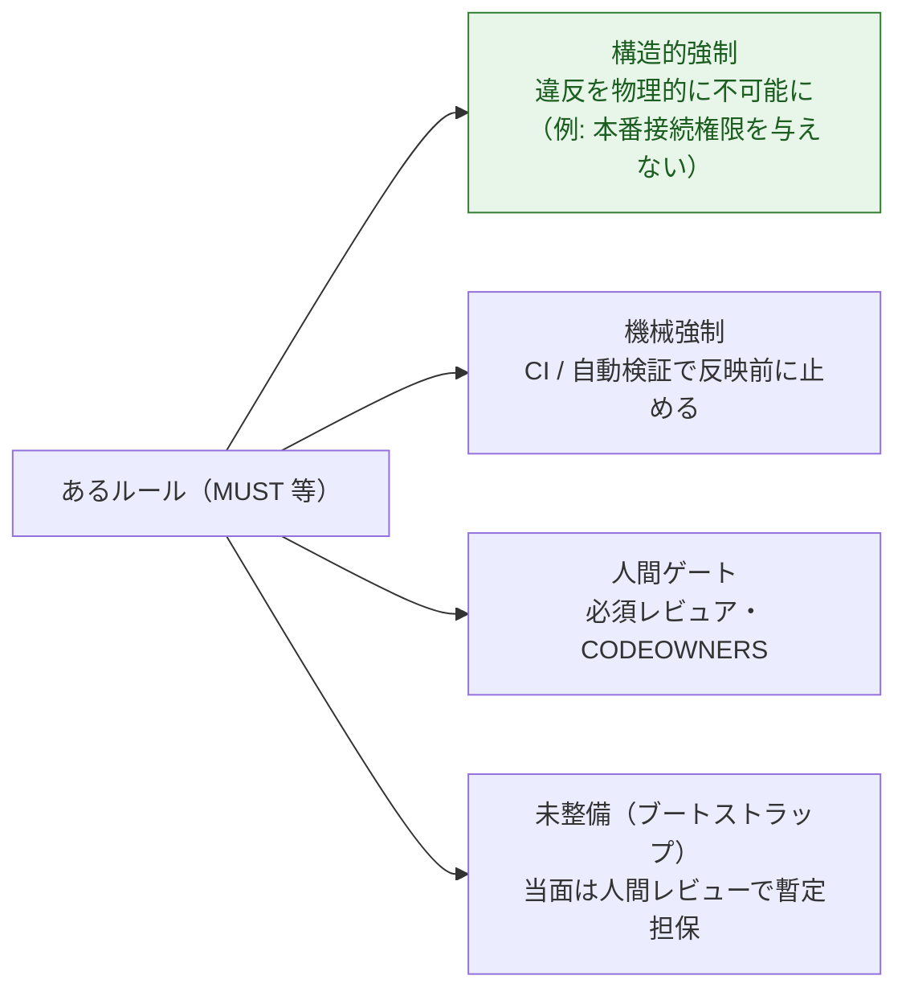
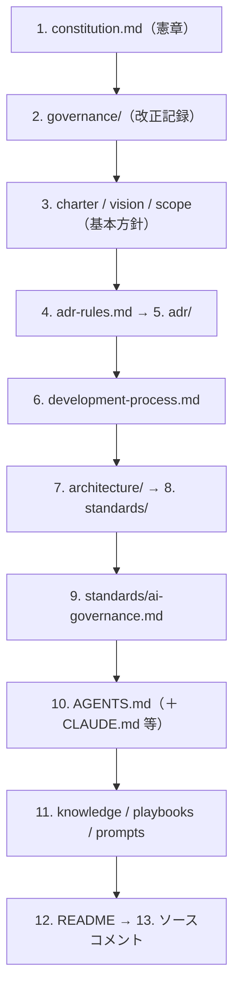

# Constitution（開発憲章）

> **一言でいうと:** このプロジェクトの **最上位ルール**（最高位の統治文書）です。
> 人間も AI エージェントも、まずこれに従います。`constitution.md` がその本体。

## 役割 — なぜ「憲章」なのか

設計判断（ADR）やプロセス（development-process）よりも上位に、**変わりにくい原則**を置くためです。
個々の判断がブレても、憲章という共通の土台があれば、人間と AI が同じ価値観で動けます。

憲章が定めるのは、たとえば次のような **原則** です（詳細ルールは下位文書へ委譲）。

- 仕様ファースト / ADR ファースト / ドキュメントファースト
- SSoT（信頼できる唯一の情報源）と Documentation as Code
- Security by Default、データ保護と AI 入力境界
- 変更分類（[Class A/B/C/D](governance.md)）と人間承認
- AI 自律境界と HITL（Human-in-the-Loop）
- 監査証跡・可逆性・サプライチェーン完全性

## RFC 2119 — 言葉の強さを統一する

憲章は **RFC 2119 / RFC 8174** のキーワードで義務の強さを表します。大文字のときだけ規範的な意味を持ちます。

| 用語 | 意味 |
| --- | --- |
| **MUST** / MUST NOT | 必須 / 禁止 |
| **SHOULD** / SHOULD NOT | 強く推奨 / 原則非推奨 |
| **MAY** | 任意 |

> これにより「〜すべき」が努力目標なのか必須なのかの解釈ブレを防ぎます。AI も人間も同じ強さで読めます。

## 「義務の強さ」と「強制手段」を分ける

憲章の特徴は、**ルールの強さ（MUST 等）** と **どう強制するか** を独立に扱う点です。強制手段は 3 種類（＋未整備）。

> **優先順位:** 可能なら **構造的強制**（そもそも違反できない）が最善。次に機械強制、次に人間ゲート。

## 文書管理階層（どれが優先か）

矛盾したときに何を優先するかが決まっています（上ほど強い）。

全文の関係は [文書マップ](../reference/document-map.md) に詳しくあります。

## 本体と「簡潔ビュー」の二段構え

憲章本体は長いため、spec-kit の **Constitution Check** 用に簡潔ビュー
`.specify/memory/constitution.md`（宣言的・テスト可能・概ね 150 行）があります。

- 簡潔ビューは本体の **派生サマリ**（非規範）。矛盾したら **本体が優先**。
- `/speckit.plan` は設計の前後で、この簡潔ビューの **Gate（合否判定）** に照らして点検します。

## 改正は「ガバナンス決定」（ADR ではない）

憲章の変更は、設計判断（ADR）とは種類が違う **ガバナンス決定** として扱います。

- 提案（Proposal）を起票 → 定められた **承認者・定足数** でレビュー → 確定記録を `governance/decisions/` へ。
- **AI は憲章改正を単独で承認・反映してはならない**（MUST NOT）。却下された提案も記録。
- バージョンは **セマンティックバージョニング**: MAJOR=後方非互換な原則変更 / MINOR=原則・ゲートの追加 / PATCH=非規範的明確化。未批准期間は `0.y.z`、正式批准で `1.0.0`。

## このテンプレートでの居場所

| 何 | どこ |
| --- | --- |
| 憲章本体 | `constitution.md` |
| ゲート用簡潔ビュー | `.specify/memory/constitution.md` |
| 改正の提案・確定記録 | `governance/proposals/`・`governance/decisions/` |

## よくある誤解

- 「憲章に全部書く」のは誤り。憲章は **原則** のみ。判定基準は `development-process.md`、AI 詳細は `standards/ai-governance.md` へ委譲。
- 「AI が憲章を直せる」わけではありません。**Class A・人間承認必須**で、AI は起案のみ。
- 「重すぎる」と感じたら、緩めるのは**人間プロセスの重さ**だけ（[段階導入](../governance/index.md)）。安全則は緩めません。

## 関連

- 仕分けの仕組み: [ガバナンスと変更クラス](governance.md)
- 機械強制の実体: [品質ゲート](quality-gates.md)
- 深掘り: [ガバナンス詳説](../governance/index.md)
