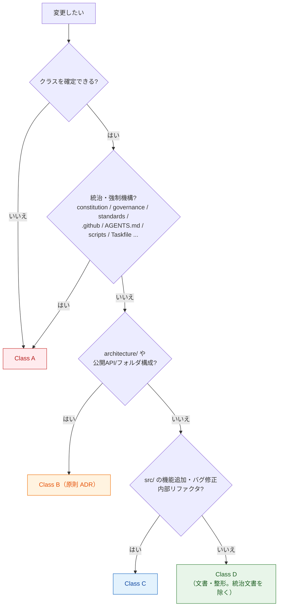
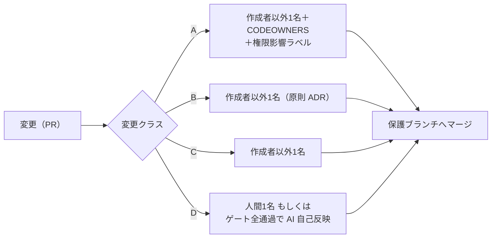
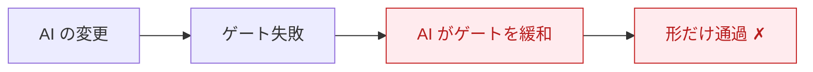

# ガバナンスと変更クラス

> **一言でいうと:** すべての変更を **A / B / C / D の 4 クラス** に仕分けて、
> 「AI が単独でやってよいこと」と「人間承認が要ること」を**自動で決める**仕組みです。

これがこのテンプレートの心臓部です。一律に厳しくすると軽微な変更が重くなり、
一律に緩いと重大変更が素通りします。だから **重さで仕分け** します。

## 変更クラス早見表

| クラス | 何が該当するか | AI の権限 | マージ |
| --- | --- | --- | --- |
| **A** | 統治・強制機構、セキュリティ、本番データ、不可逆操作 | **下書きのみ** | 人間承認＋CODEOWNERS＋権限影響ラベル |
| **B** | アーキテクチャ、公開API/インターフェース | 下書き（ADR 起票含む） | 人間承認＋原則 ADR |
| **C** | 通常の機能追加・バグ修正・内部リファクタ | 下書き・実装まで | 人間がマージ承認 |
| **D** | ドキュメント・整形（**統治文書を除く**） | 下書き＋**自己反映可※** | 品質ゲート全通過時 |

> ※ Class D の自己反映は、ドキュメント品質ゲート（Markdown Lint・Link Check）全通過を条件に
> `standards/ai-governance.md` が許可する場合のみ。**統治文書は Class D ではなく A** です。

> **最重要の既定動作:** **クラスが確定しないものは最も厳しい Class A 扱い**（フェイルセーフ）。

## クラスの決め方（パス → 内容の順）

判定はまず **対象パス** で一次判定し、複数該当なら **最も厳しいクラス** を採用します。

> **内容トリガ:** 対象パスが `src/`（一見 Class C）でも、内容が「公開API変更」「スキーマ変更」
> 「認証・認可の方式変更」「外部依存の新規追加」「永続データの不可逆操作」を含むなら **Class B 以上** に引き上げます。

## クラスが影響する 4 つのこと

1. **ADR の要否**（Class A/B は原則 ADR）
2. **承認の要否**（下の承認マトリクス）
3. **完了条件の品質ゲート**（[品質ゲート](quality-gates.md)）
4. **AI の自律範囲**（起案は常に可、反映はクラス次第）

## 承認マトリクス（誰の承認が要るか）

## 権限昇格・自己修正ループの防止

AI 駆動だからこそ必要な、2 つの「抜け道封じ」があります。

- **作成者 ≠ 承認者（職務分掌）:** AI は **自分が関わった権限拡大を承認・自己マージしてはならない**（MUST NOT）。
  軽微な変更（CLAUDE.md・CI 設定・ADR 起票）の積み重ねによる事実上の権限昇格を防ぎます。
- **自己修正ループの防止:** AI が自分の変更で失敗したゲートを、**回避目的で弱めてはならない**（MUST NOT）。
  品質ゲート定義や統治機構に属するパスへの変更は、目的を問わず **Class A** とし、人間承認を必須にします。

> この「AI の変更 → ゲート失敗 → AI がゲートを緩める → 通過」というループを、構造的に封じています。

## HITL チェックポイント（AI が止まる点）

次の局面で AI は判断を**停止し、人間に諮らねばなりません**（MUST）。

- 原則どうしが競合し、自律的に解消できないとき
- 機密区分が未確定のデータを扱うとき
- 自分の権限・統治機構に影響する変更を提案するとき
- 憲章・ADR・実装の間に矛盾を見つけたとき
- 参照すべき下位文書が未整備で判断根拠が足りないとき

## 段階導入（重さは選べる）

統治の重さは画一ではありません。**人間プロセスの重さ**だけを規模・規制に応じて調整できます。

| プロファイル | 想定 | 重さ |
| --- | --- | --- |
| **Lite** | 個人〜小規模・非規制 | 承認者1名・ADR は重要決定のみ |
| **Standard**（既定） | 通常チーム | CODEOWNERS・原則 ADR |
| **Regulated** | 規制・監査対象 | 憲章承認者2名・ADR full・記名監査 |

> 絶対ルール（本番 PII を AI に渡さない／作成者≠承認者／統治機構の自己反映禁止／ゲート未通過のマージ禁止）は
> **どのプロファイルでも緩められません**。詳細は [ガバナンス詳説](../governance/index.md)。

## このテンプレートでの居場所

| 何 | どこ |
| --- | --- |
| 変更分類の原則 | `constitution.md`「4. 変更分類」「6.」 |
| 判定基準（対象パス対応表） | `development-process.md`「1.」 |
| AI 自律の詳細方針 | `standards/ai-governance.md` |
| 承認の機械強制 | `.github/CODEOWNERS`・ブランチ保護 |

## 関連

- 上位ルール: [Constitution](constitution.md)
- 機械強制の実体: [品質ゲート](quality-gates.md)
- 深掘り（強制台帳・Break-glass・承認者）: [ガバナンス詳説](../governance/index.md)
