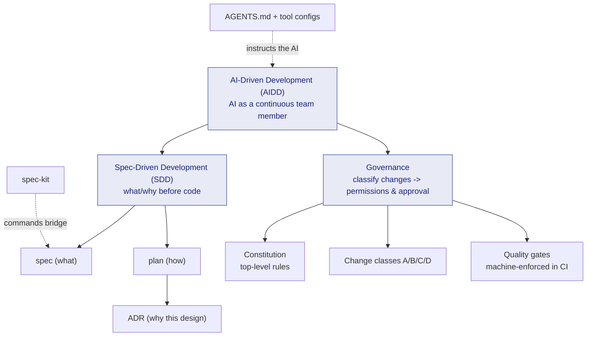

# Concepts

This section explains **why the template has the shape it does**. It clicks best after you have tried the [Getting Started](../getting-started/index.md) hands-on steps.

## The big picture — how the concepts relate

Everything centers on one point: **let AI write fast, while always recording design rationale and approvals.**

## What each page covers

| Concept | In one line | Prerequisite |
| --- | --- | --- |
| [AI-Driven Development (AIDD)](ai-driven-development.md) | Treat AI as a continuous team member, with safety rails | none |
| [Spec-Driven Development (SDD)](spec-driven-development.md) | Write what/why before code; separate spec / plan / ADR | none |
| [ADR](adr.md) | A one-file record of "why this design" | SDD |
| [Constitution](constitution.md) | Top-level rules both humans and AI follow | none |
| [Governance & Change Classes](governance.md) | A/B/C/D weight decides AI autonomy and human approval | Constitution |
| [spec-kit](spec-kit.md) | Run the SDD flow via `/speckit.*` commands | SDD |
| [Quality Gates](quality-gates.md) | Local = AI = CI run the same machine-enforced checks | none |
| [Multi-Agent & Claude Code](multi-agent.md) | Run multiple AI tools under one rule set | AIDD |

> **Suggested order (least prerequisite first):** [AIDD](ai-driven-development.md) -> [SDD](spec-driven-development.md) -> [ADR](adr.md) -> [Constitution](constitution.md) -> [Governance](governance.md).
