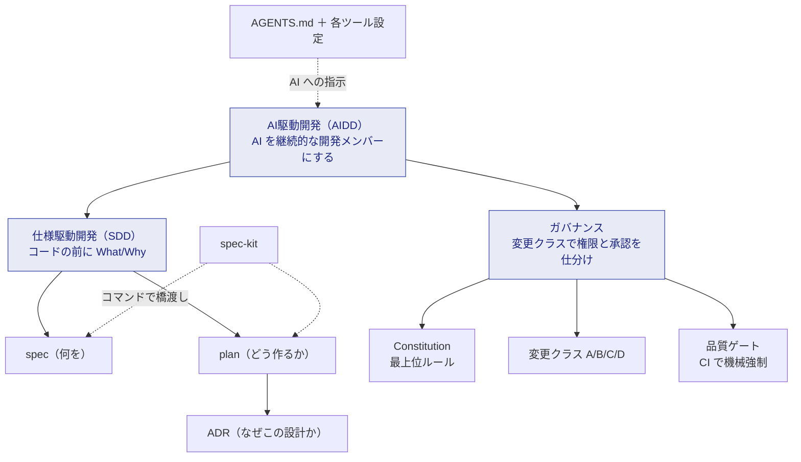

# コンセプト（考え方）

このセクションは「**なぜこのテンプレートはこういう形なのか**」を理解するためのものです。
[はじめに](../getting-started/index.md) で手を動かした後に読むと、すべてが腑に落ちます。

## 全体像 — 概念どうしの関係

中心にあるのは **「AI に速く書かせつつ、設計理由と承認を必ず残す」** という一点です。
そのために、次の概念が層をなしています。

## 各ページの読みどころ

| 概念 | 一言でいうと | 前提知識 |
| --- | --- | --- |
| [AI駆動開発（AIDD）](ai-driven-development.md) | AI を「継続的な開発メンバー」として扱う前提と、その安全装置 | なし |
| [仕様駆動開発（SDD）](spec-driven-development.md) | コードの前に「何を・なぜ」を書く。spec / plan / ADR の役割分担 | なし |
| [ADR](adr.md) | 「なぜこの設計にしたか」を 1 ファイルに残す記録 | SDD |
| [Constitution](constitution.md) | 人間も AI も従う最上位ルール（開発憲章） | なし |
| [ガバナンスと変更クラス](governance.md) | 変更の重さ A/B/C/D で、AI の自律範囲と人間承認を自動で決める | Constitution |
| [spec-kit](spec-kit.md) | `/speckit.*` コマンドで SDD フローを実行するツールキット | SDD |
| [品質ゲート](quality-gates.md) | ローカル = AI = CI で同じチェックを機械強制する仕組み | なし |
| [マルチエージェントとClaude Code](multi-agent.md) | 複数 AI ツールを同じルールで動かす方法 | AIDD |

## 用語の地図

略語が多い領域です。迷ったら [用語集](../reference/glossary.md) を引いてください。よく出る 5 語だけ先に:

| 略語 | 正式名 | ざっくり |
| --- | --- | --- |
| **AIDD** | AI-Driven Development | AI 主体の開発 |
| **SDD** | Spec-Driven Development | 仕様ファーストの開発 |
| **ADR** | Architecture Decision Record | 設計判断の記録 |
| **spec** | Specification | 仕様（何を・なぜ） |
| **HITL** | Human-in-the-Loop | 要所で人間が判断する仕組み |

> **読む順番に迷ったら:** [AIDD](ai-driven-development.md) → [SDD](spec-driven-development.md) → [ADR](adr.md) → [Constitution](constitution.md) → [ガバナンス](governance.md) が、前提知識の少ない順です。
