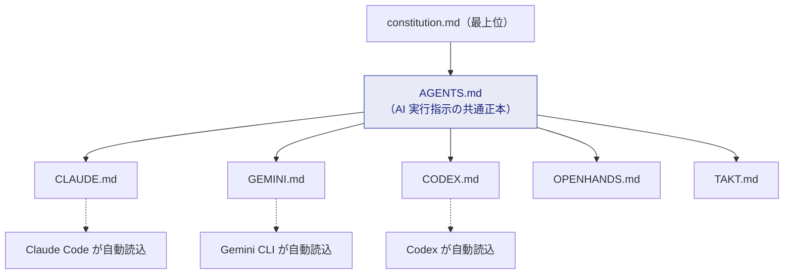
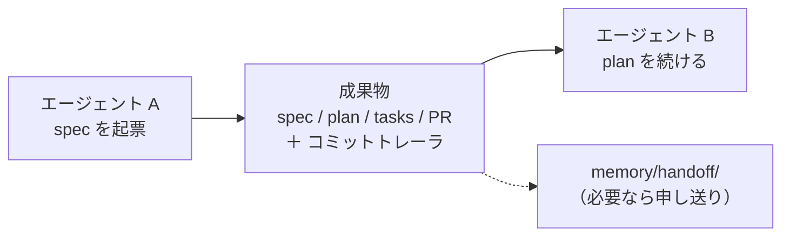

# マルチエージェントとClaude Code

> **一言でいうと:** Claude Code / Codex / Gemini CLI / OpenHands / Takt など **複数の AI ツールを、
> 同じ 1 セットのルールで** 動かすための仕組みです。ルールの正本は `AGENTS.md` ただ 1 つ。

## 問題 — ツールごとに設定がバラバラだと統治できない

AI ツールはそれぞれ独自の設定ファイルを自動読込します（Claude Code は `CLAUDE.md`、Gemini CLI は `GEMINI.md` など）。
ここに別々のルールを書くと、ツールを変えるたびに挙動がブレ、統治が破綻します。

## 解決 — 共有正本 ＋ 薄い委譲

このテンプレートは **`AGENTS.md` を共有の正本** とし、各ツール固有ファイルは
「`AGENTS.md` を見てね」という **薄い委譲層** にとどめます。

> **なぜ `CLAUDE.md` 等をルート直下に残すのか:** 各 CLI が**リポジトリ直下の固定パスで自動読込**するためです。
> `agents/` へ移すと自動読込が壊れます。だからツール固有ファイルはルート、名簿・協調は `agents/`。

## エージェント名簿（roster）とマシンアイデンティティ

`agents/README.md` が **全エージェントの名簿** と協調プロトコルの正本です。

| エージェント | 自動読込ファイル | 専用マシンID（採用時に確定） |
| --- | --- | --- |
| Claude Code | `CLAUDE.md` | `@bot/claude` |
| Codex | `CODEX.md` | `@bot/codex` |
| Gemini CLI | `GEMINI.md` | `@bot/gemini` |
| OpenHands | `OPENHANDS.md` | `@bot/openhands` |
| Takt | `TAKT.md` | `@bot/takt` |

> **重要:** AI は **人間の認証情報で行為してはならない**（MUST NOT）。各エージェントは**専用の識別可能なマシンアカウント**で動きます。
> これにより「作成者 ≠ 承認者」を機械的に強制でき、誰（どの AI）が起案したかを監査できます。

## ハンドオフは「成果物」で行う（会話履歴に依存しない）

複数エージェントの引き継ぎは、チャット履歴ではなく **成果物** で行います。

- **共有正本**: 全員が `AGENTS.md` と `constitution.md` を見る。
- **所有境界**: Class A（統治・強制機構）は **起案のみ**。承認・自己マージ禁止。
- **競合裁定**: エージェント間で結論が割れたら、自律解消せず **人間に諮る**（HITL）。
- **同時実行**: 同じファイルの並行編集を避け、`specs/<feature>/` 単位で分担。

## Claude Code 固有のメモ

- 入口は `CLAUDE.md`（`@AGENTS.md` を取り込む薄い委譲層）。
- ゲート判定には憲章の簡潔ビュー `.specify/memory/constitution.md` を使い、必要な章だけ本体を参照。
- `CLAUDE.md` 自体の変更は **Class A**（単独反映しない）。
- スキルは `SKILLS.md`（実体 `skills/`、Claude Code では `.claude/skills` も利用可）。

## このテンプレートでの居場所

| 何 | どこ |
| --- | --- |
| AI 実行指示の共通正本 | `AGENTS.md` |
| ツール固有の薄い設定 | `CLAUDE.md` / `GEMINI.md` / `CODEX.md` / `OPENHANDS.md` / `TAKT.md` |
| 名簿・協調プロトコル | `agents/README.md` |
| 能力カタログ | `SKILLS.md`（→ `skills/`） |

## よくある誤解

- 「ツールごとに別ルール」は誤り。ルールは **1 つ（`AGENTS.md`）** に集約。
- 「AI がリーダーの GitHub アカウントで PR を出す」は禁止。**専用マシンアカウント**を使います。

## 関連

- 前提: [AI駆動開発（AIDD）](ai-driven-development.md)
- 仕分け: [ガバナンスと変更クラス](governance.md)
- 能力（スキル）の扱い: [リファレンス](../reference/index.md)
