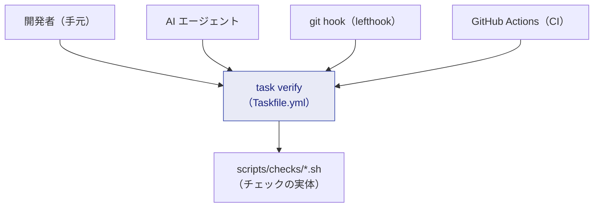
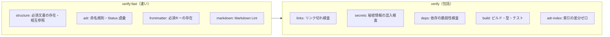

# 品質ゲート（Quality Gates）

> **一言でいうと:** ルールを「書く」だけでなく、**機械が“通らないと止める”** 仕組みです。
> 重要なのは **開発者・AI エージェント・CI が、まったく同じコマンドを実行する**こと（Single Source of Truth）。

## なぜ「ローカル = AI = CI」なのか

チェックの実体がバラバラだと、「ローカルでは通ったのに CI で落ちる」が起きます。
このテンプレートは **`task verify` という単一の入口** に一元化し、誰が実行しても同じ結果にします。



## 3 つの実行タイミング

| タイミング | コマンド | 内容 |
| --- | --- | --- |
| **コミット前（高速）** | `task verify:fast` | structure / ADR / ADR内容 / front matter / prompts / markdown |
| **Push前・PR・CI（包括）** | `task verify` | 上記 ＋ ADR索引 / link / secret / 依存脆弱性 / build |
| **PR 文脈（統治）** | `task verify:pr` | PR ガバナンス / ADR 不変性 / 採用結線（adoption）点検 |

## 各チェックが守るもの



これらは憲章「8. 機械的に検証可能なルール」に登録された MUST/MUST NOT に対応します。
たとえば「秘密情報をハードコードしない」「壊れたリンクをコミットしない」「重大変更の PR に ADR 参照がある」など。

## ツールチェーンと Git フック

- **mise**（`.mise.toml`）: チェックツールのバージョンを固定。`task setup` でまとめて導入。
- **lefthook**（`lefthook.yml`）: `.git/hooks` を直接触らず、コミット/プッシュ時に `task verify` 系を自動実行。`task hooks` で有効化。
- **CI**（`.github/workflows/verify.yml`）: 独自ロジックを持たず、ただ `task verify` を呼ぶだけ。

```bash
task setup        # ツール導入（mise）
task hooks        # git フック有効化（lefthook）
task verify:fast  # コミット前の高速チェック
task verify       # CI と同一の包括チェック
task fix          # markdownlint --fix ＋ ADR 索引再生成
task doctor       # 使えるツールの一覧
```

## 最重要の原則 — ゲートを弱めない

> **自分の変更で失敗したゲートを、回避目的で弱めてはならない（MUST NOT）。** 原因側を直します。
> ゲートの実体（`Taskfile.yml` / `lefthook.yml` / `.mise.toml` / `scripts/**` / `.github/**`）への変更は
> **すべて Class A**（人間承認必須）です。これにより「[自己修正ループ](governance.md)」を構造的に封じます。

## 採用時の結線（ローカルだけでは完成しない）

CI のスクリプトが緑でも、**ブランチ保護**で `verify` を必須チェックに登録しないと強制は効きません。
この「結線」は `ADOPTION.md` に従って、リポジトリ/組織の設定として行います（[ガバナンス詳説](../governance/index.md)）。

## このテンプレートでの居場所

| 何 | どこ |
| --- | --- |
| ゲートの入口 | `Taskfile.yml` |
| チェックの実体 | `scripts/checks/*.sh` |
| Lint 設定 | `.markdownlint.jsonc` |
| Git フック | `lefthook.yml` |
| CI | `.github/workflows/verify.yml` |

## よくある誤解

- 「CI に特別なロジックがある」わけではありません。CI も **`task verify` を呼ぶだけ**。
- 「コードが無いと CI が落ちる」わけではありません。コードが無くてもグリーンで通り、コードを足すと自動で有効化されます。

## 関連

- 仕分けの仕組み: [ガバナンスと変更クラス](governance.md)
- コマンドの詳細: [コマンド集](../reference/commands.md)
- つまずき: [トラブルシューティング](../troubleshooting.md)
