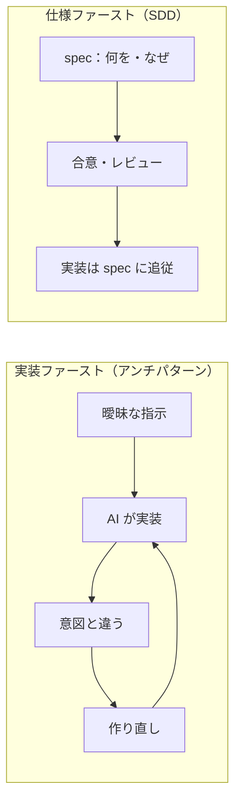
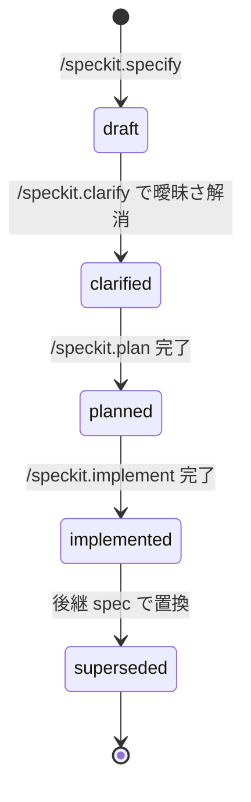

# 仕様駆動開発（SDD）

> **一言でいうと:** コードを書く **前** に「**何を・なぜ**（What/Why）」を仕様として書き、
> 実装はその仕様に追従させる進め方です。SDD = **Spec-Driven Development**（仕様ファースト）。

## なぜ仕様を先に書くのか

AI は指示されればすぐ実装します。しかし要求が曖昧なまま実装が走ると、
**「何を作りたかったのか」が実装に埋もれて**しまい、後から検証も修正もできません。



SDD では、**仕様が「受け入れ基準」** になります。実装が正しいかは「仕様を満たすか」で判定できます。

## 3 つの成果物の役割分担（重複させない）

SDD で最も大切なのは、**3 つの文書の責務を混ぜない**ことです。

| 成果物 | 答える問い | 正本の場所 |
| --- | --- | --- |
| **spec** | **何を**作るか・**なぜ**必要か（What/Why） | `specs/<feature>/spec.md` |
| **plan** | **どう**作るか（How：設計・手順） | `specs/<feature>/plan.md` |
| **ADR** | **なぜこの設計**にしたか（判断・根拠・却下案） | `adr/adr-NNNN-*.md` |

> **覚え方:** spec = What/Why、plan = How、ADR = Why-this-design。
> 「なぜ必要か（spec）」と「なぜこの設計か（ADR）」は別物です。前者は要求、後者は設計判断。

## 仕様のライフサイクル

spec はフロントマターの `status` で状態を管理します（同梱サンプルの値に対応）。



## 良い spec の条件

同梱サンプル `specs/001-user-profile-export/spec.md` が手本です。要点は次の通り。

- **What/Why に限定**（How は plan、Why-this-design は ADR へ追い出す）
- ユーザーシナリオが **受け入れ基準** として機能する（Given/When/Then）
- 各機能要求（FR）が **テスト可能** で、曖昧語がない
- **非ゴール** を明記する（やらないことを決める）
- **データ機密区分** を特定し、AI 入力境界に照合する（例: PII = Restricted）
- 暫定の **変更クラス** を置く（例: 公開API追加なら Class B）

> **乖離したら:** spec と実装がずれたら、**実装を直すか spec を更新する**かのどちらかで解消します。
> どちらにするかは人間が判断します（憲章の原則）。

## spec-kit との関係

SDD の各ステップは [spec-kit](spec-kit.md) のコマンドに対応します。

```text
/speckit.specify  → spec.md（What/Why）
/speckit.clarify  → spec.md の曖昧点を解消
/speckit.plan     → plan.md（How）＋ Constitution Check ＋ ADR 起票
/speckit.tasks    → tasks.md（クラス・承認要否を付す）
/speckit.implement→ 実装（テスト含む）
```

## このテンプレートでの居場所

| 何 | どこ |
| --- | --- |
| 仕様ファースト原則 | `constitution.md`「基本原則／仕様ファースト」 |
| 仕様の正本・粒度・テンプレート | `development-process.md`「2.」 |
| 様式 | `.specify/templates/{spec,plan,tasks}-template.md` |
| 実例 | `specs/001-user-profile-export/`・`specs/002-account-deletion/` |

## よくある誤解

- 「spec に設計を書く」のは誤り。設計（How）は plan、設計理由は ADR。
- 「大きな仕様書を 1 つ」ではなく、**1 機能 = 1 spec ディレクトリ**（ユーザーに価値を届ける最小単位）。
- 「仕様を書いたら終わり」ではなく、**実装が spec に追従**し続けます。

## 関連

- 次に読む: [ADR（設計判断の記録）](adr.md)
- 手を動かす: [チュートリアル3「仕様を作成する」](../tutorials/03-write-spec.md)
- 実例: [実例で学ぶ](../examples/index.md)
