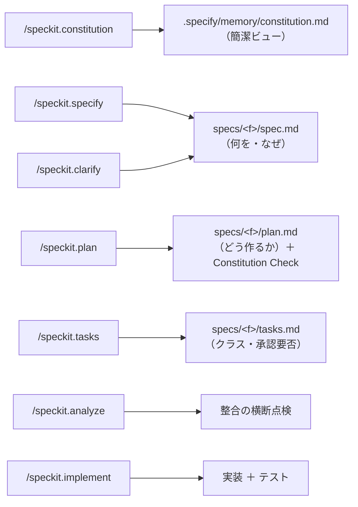

# spec-kit

> **一言でいうと:** 仕様駆動開発（[SDD](spec-driven-development.md)）を、AI エージェント上の
> **`/speckit.*` スラッシュコマンド** として実行できるツールキットです。
> このテンプレートは spec-kit のフローに乗る前提で設計されています。

## spec-kit が提供するもの

spec-kit は、AI エージェントに「仕様 → 設計 → 分解 → 実装」の手順を**コマンドとして**与えます。
人間は自然言語で要求を伝え、AI が各段階の成果物を**下書き**します。

## コマンドと成果物の対応

| コマンド | 作るもの（正本） | このテンプレートでの意味 |
| --- | --- | --- |
| `/speckit.constitution` | `.specify/memory/constitution.md` | 憲章の簡潔ビューを保守 |
| `/speckit.specify` | `specs/<f>/spec.md` | What/Why（[SDD](spec-driven-development.md)） |
| `/speckit.clarify` | spec.md の `[NEEDS CLARIFICATION]` 解消 | 曖昧さをつぶす |
| `/speckit.plan` | `specs/<f>/plan.md` | How ＋ **Constitution Check** ＋ Class A/B なら ADR 起票 |
| `/speckit.tasks` | `specs/<f>/tasks.md` | 各タスクに [変更クラス](governance.md)・承認要否を付す |
| `/speckit.analyze` | （点検） | 憲章 8 章 ＋ spec/plan/constitution の整合 |
| `/speckit.implement` | コード等 | [完了条件](quality-gates.md)を満たすまで実装・検証 |

## Constitution Check — 設計を憲章に照らす

`/speckit.plan` の核心が **Constitution Check** です。設計の **前後** で、
[Constitution の簡潔ビュー](constitution.md) の各原則（Gate）に違反していないかを点検します。

- 違反があれば、`plan.md` の Complexity Tracking に **違反内容・正当化・より単純な代替案を却下した理由** を記録。
- 正当化できない違反は **設計をやり直し** ます。

> これにより「憲章は飾り」になるのを防ぎ、**設計段階でルール適合を強制**します。

## doc-churn（文書だけの空回り）を避ける

spec / plan / tasks / ADR は**目的ではなく手段**です。`/speckit.implement` は
**実装とテストを前進**させること。ドキュメント更新だけで反復を消費せず、
各反復で **コードまたはテストの前進** を伴わせます。

## 導入

spec-kit の導入方法は公式リポジトリを参照してください。

- 公式: <https://github.com/github/spec-kit>
- 環境準備の位置づけ: [前提環境を整える](../getting-started/prerequisites.md)

> このテンプレート自体は spec-kit に**強く依存はしません**（成果物はただの Markdown です）。
> spec-kit があると、その作成フローを AI エージェントの定型コマンドとして回せる、という関係です。

## よくある誤解

- 「spec-kit がこのテンプレートの本体」ではありません。本体は **憲章・ADR・ガバナンス**。spec-kit は**実行手段**。
- 「コマンドを打てば全自動」ではありません。各成果物は**人間レビュー前提の下書き**です。

## 関連

- 思想: [仕様駆動開発（SDD）](spec-driven-development.md)
- 体験: [30分クイックスタート](../getting-started/quickstart.md)
- コマンド一覧: [コマンド集](../reference/commands.md)
