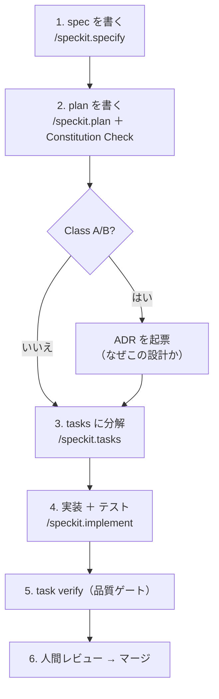

# 最初の機能を作る（一周する）

> **ゴール:** 1 つの小さな機能を **spec → plan → tasks → 実装 → レビュー** まで通し、開発サイクルの全体像を体で覚える。
> **このページの役割:** 全体の地図。各ステップの **詳細は対応するチュートリアル** にあります（重複を避けるため、ここでは流れだけ）。



## ステップ 1 — 何を・なぜ（spec）

`/speckit.specify` で、機能の **What（何を）/ Why（なぜ）** を書きます。**How（どう作るか）は書きません。**
受け入れ基準になるユーザーシナリオと、テスト可能な機能要求（FR）を含めます。

→ 詳細: [チュートリアル3「仕様（Spec）を作成する」](../tutorials/03-write-spec.md) ／ 考え方: [SDD](../concepts/spec-driven-development.md)

## ステップ 2 — どう作るか（plan）と、なぜ（ADR）

`/speckit.plan` で設計（How）を書き、**Constitution Check** で憲章との整合を確認します。
変更が **Class A / B**（アーキテクチャ・公開API・セキュリティ等）なら、**ADR** に「採用案・却下案・理由」を残します。

→ 詳細: [チュートリアル2「ADRを作成する」](../tutorials/02-write-adr.md) ／ 考え方: [ADR](../concepts/adr.md)・[Constitution](../concepts/constitution.md)

## ステップ 3 — 作業に分解（tasks）

`/speckit.tasks` で、実行可能な単位に分解します。各タスクには **変更クラス** と **承認の要否** を付けます。

→ 考え方: [ガバナンスと変更クラス](../concepts/governance.md)

## ステップ 4 — 実装＋テスト（implement）

`/speckit.implement` で、AI に実装とテストを下書きさせます。
ドキュメントを更新しただけで終わらせず、**コードまたはテストの前進** を必ず伴わせます（doc-churn 回避）。

→ 詳細: [チュートリアル4「Claude Codeで実装する」](../tutorials/04-implement.md)

## ステップ 5 — 品質ゲート（task verify）

```bash
task verify        # CI と同一の包括チェック
```

秘密情報・脆弱性・テスト・ADR 記載などを **機械的に** チェックします。赤なら原因側を直します（ゲートを緩めない）。

→ 詳細: [品質ゲート](../concepts/quality-gates.md)

## ステップ 6 — レビューとマージ

PR を出し、**作成者以外の人間** がレビュー・承認します。Class A/B は承認必須、Class D（統治文書を除く）は条件を満たせば AI 自己反映も可。

→ 詳細: [チュートリアル5「レビューする」](../tutorials/05-review.md)

---

## 一周したら

- 運用（リリース・障害対応・憲章改正）まで体験する → [チュートリアル6「運用する」](../tutorials/06-operate.md)
- 自組織へ本格導入する → [ガバナンス詳説](../governance/index.md)
- 体系的に学び直す → [学習ロードマップ](../learning-path.md)
