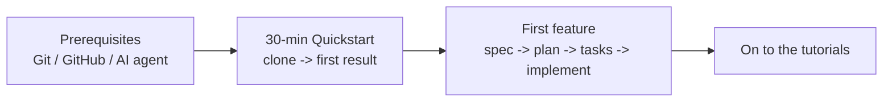

# Getting Started

This section is about **getting a quick win first**. Theory can wait. Three pages take you from setup to a first result in about an hour.

| Step | Page | Time | Goal |
| --- | --- | --- | --- |
| 1 | [Prerequisites](prerequisites.md) | ~20 min | Git, GitHub, an AI agent |
| 2 | [30-Minute Quickstart](quickstart.md) | ~30 min | Run the template, create your first artifact |
| 3 | [Build Your First Feature](first-feature.md) | ~45 min | One full spec -> plan -> tasks -> implement loop |

> **In a hurry?** If you already have Git and an AI agent (e.g. Claude Code), jump straight to the [30-Minute Quickstart](quickstart.md).

## After this section

- You can run the template in your own environment.
- Your first spec exists under `specs/`.
- You have experienced the "AI drafts, humans approve" flow.
- You know what to learn next ([Learning Path](../learning-path.md)).

> **Stuck?** Check [Troubleshooting](../troubleshooting.md) and the [FAQ](../faq.md) first — most setup issues are covered there.
