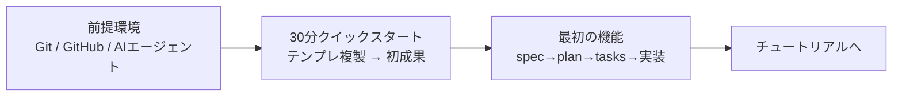

# はじめに

このセクションは「**まず動かして成功体験を得る**」ためのものです。理屈は後回しでも構いません。
3 つのページを順番に進めれば、約 1 時間で **環境準備 → 初成果** まで到達できます。

| ステップ | ページ | 所要 | ゴール |
| --- | --- | --- | --- |
| 1 | [前提環境を整える](prerequisites.md) | 約20分 | Git・GitHub・AI エージェントの準備 |
| 2 | [30分クイックスタート](quickstart.md) | 約30分 | テンプレートを動かし、最初の成果物を作る |
| 3 | [最初の機能を作る](first-feature.md) | 約45分 | spec → plan → tasks → 実装の一周を体験 |

> **急いでいるなら:** すでに Git と AI エージェント（Claude Code など）が手元にあるなら、
> [30分クイックスタート](quickstart.md) に直行して構いません。

## このセクションを終えると

- テンプレートを自分の環境で動かせる
- `specs/` に自分の最初の仕様（spec）が 1 本できている
- 「AI が下書きし、人間が承認する」流れを体験している
- 次に何を学べばよいか（[学習ロードマップ](../learning-path.md)）が分かる

> **つまずいたら:** [トラブルシューティング](../troubleshooting.md) と [FAQ](../faq.md) を先に見てください。
> 導入時の失敗はほとんどがそこに載っています。
