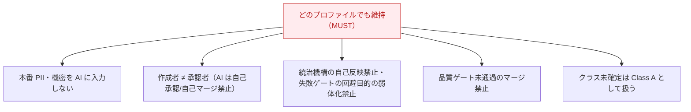

# ガバナンス詳説

[ガバナンスと変更クラス](../concepts/governance.md) が「考え方」なら、ここは **組織へ展開するための実務**です。
チームリード・テックリード・監査対応の人向け。

## 変更対象ごとの手続き

「何を変えるか」で手続きが変わります。憲章と通常の設計変更（ADR）の中間にある文書の手続きが
未定義にならないよう、対応づけられています。

| 対象 | 手続き | 記録先 |
| --- | --- | --- |
| 開発憲章（`constitution.md`） | ガバナンス決定 | `governance/` |
| 基本方針（`charter`/`vision`/`scope`） | ガバナンス決定 | `governance/` |
| 統治・強制機構（`standards/ai-governance.md`、CI/CD、ブランチ保護、セキュリティ方針） | ガバナンス決定 | `governance/` |
| ADR 運用規則（`adr-rules.md`） | ガバナンス決定 | `governance/` |
| その他の技術標準（`standards/*`） | ADR（重大時）または通常変更 | `adr/` |
| 設計・実装 | ADR（必要時）＋通常変更 | `adr/` |

## 承認者と定足数

> グループ名・人数は採用組織が確定するプレースホルダです。

| 対象 | 必要承認 | 定足数 |
| --- | --- | --- |
| 憲章の改正 | 憲章承認者グループ（`@org/governance-approvers`） | **2 名以上**、AI 単独不可 |
| 基本方針・統治機構・`adr-rules.md` | 同上 | 2 名以上 |
| Class A | 作成者以外 1 名以上 ＋ CODEOWNERS | 1 名以上 |
| Class B | 作成者以外 1 名以上 | 1 名以上 |
| Class C / D | 作成者以外 1 名以上（D の自律反映例外あり） | 1 名以上 |

## 段階導入プロファイル

統治の重さは規模・規制で選びます。**プロファイルの選択自体をガバナンス決定として記録**します。

| 項目 | Lite | Standard（既定） | Regulated |
| --- | --- | --- | --- |
| 想定 | 個人〜小規模・非規制・PoC | 通常のチーム開発 | 規制・監査対象・大組織 |
| 憲章改正の定足数 | 1 名（オーナー） | 2 名以上 | 2 名以上＋記名監査 |
| Class A 承認 | 作成者以外1名 | ＋CODEOWNERS | ＋セキュリティ承認 |
| Class B の ADR | 重要決定のみ | 原則 ADR 化 | ADR 化（full） |
| skills/knowledge/prompts | 任意 | 推奨 | 必須（監査対象） |
| カバレッジ初期値 | 緩和可（例 40%） | 全体60%/差分80% | 差分80%＋引き上げ |
| ADR テンプレート | minimal 既定 | minimal/full 選択 | full 既定 |

### どのプロファイルでも緩められない絶対ルール



## 強制手段と強制台帳

各ルールには **強制手段**（構造的強制 / 機械強制 / 人間ゲート / 未整備）が割り当てられ、
**強制台帳**（`governance/enforcement-ledger.md`）で網羅性を管理します。

- 台帳は憲章の MUST/MUST NOT 抽出から生成し、手動同期を最小化（SSoT）。
- 検証手段が整備されたら、人間レビューから自動検証へ移行。
- 「未整備の MUST を整備済みのように扱わない」（ブートストラップ規定）。

## CODEOWNERS とブランチ保護（結線して初めて効く）

統治文書が完成していても、**リポジトリ/組織側の設定**をしないと強制は効きません（`ADOPTION.md`）。

- ブランチ保護（`main` / `release/*`）: 作成者以外の承認、**include administrators**、force-push 禁止、必須ステータスチェック `verify`。
- `.github/CODEOWNERS`: 統治・強制機構のパスに必須レビュアを割り当て。
- `permission-impact` ラベル: 統治・強制機構に触れる PR へ自動付与し CODEOWNERS 承認を要求。
- マシンアカウント: AI は人間の認証情報で行為しない（専用 `@bot/*`）。

## Break-glass（緊急時例外）

本番障害などの緊急時のみ、事前検証を事後検証へ切り替え可（MAY）。ただし:

- 人間（緊急承認者）の承認は**免除されない**。
- 適用の事実・理由・範囲・承認者を記録し、**72 時間以内に事後レビュー**を完了（MUST）。
- 統治機構の恒久的緩和や改正手続きの回避には**使えない**。

## `governance/` ディレクトリ

```text
governance/
├─ proposals/        改正提案（Proposal）
├─ decisions/        改正の確定記録（承認・却下を含む。正本）
├─ exceptions/       例外
├─ waivers/          適用除外
├─ risk-register/    リスク登録
└─ enforcement-ledger.md  強制台帳（各 MUST に強制手段を割当）
```

> ガバナンス決定の Status 語彙（Draft / Proposed / Accepted / Rejected / Superseded / Withdrawn）は
> ADR の Status 語彙とは**別物**です。混同しないこと。

## 関連

- 考え方: [ガバナンスと変更クラス](../concepts/governance.md)
- 上位ルール: [Constitution](../concepts/constitution.md)
- 運用の実践: [チュートリアル6「運用する」](../tutorials/06-operate.md)
