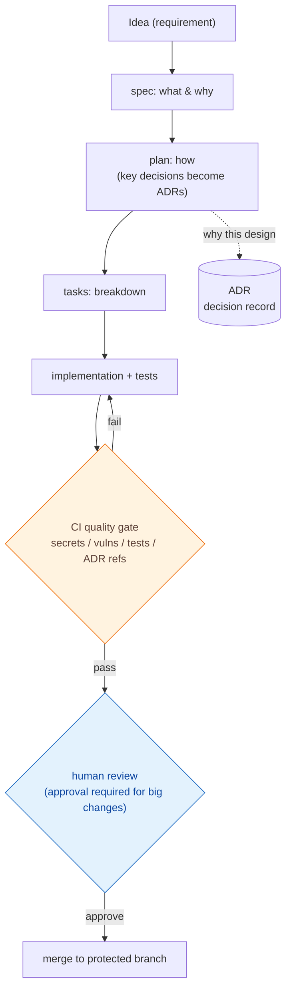

# AI Agent Development Template — Documentation

> A project template — and a learning resource for the **operating model itself** — that lets AI agents (Claude / Codex / Gemini, etc.) write code **safely and traceably**.

> **Note on languages:** This site is authored primarily in Japanese. English pages are being added incrementally; pages without an English version fall back to Japanese automatically. Use the language switcher in the header.

This site is designed so that someone seeing the template for the first time (comfortable with GitHub, but new to AI-driven development) can:

- understand **what** it is,
- internalize **why** it is needed and **what** it solves,
- actually **adopt** it,
- **apply** it to their own project,
- and finally understand the **philosophy** behind ADR and SDD.

[Try it in 30 minutes :material-rocket-launch:](getting-started/quickstart.md){ .md-button .md-button--primary }
[Learn the concepts :material-book-open-variant:](concepts/index.md){ .md-button }
[See the learning path :material-map:](learning-path.md){ .md-button }

---

## What problem does it solve?

AI agents write code fast, but **left unchecked** they tend to:

- leave no record of **why** a design was chosen,
- produce docs where requirements, design, and implementation are tangled,
- touch production data, secrets, or CI config by accident,
- leave no trace of **who approved what and why**.

Fine for a personal prototype, but a real incident in **team development, long-term maintenance, or regulated work**. This template gives the AI **rules + an approval workflow + a duty to record**, enforced structurally.

| Without structure (common) | This template |
| --- | --- |
| AI implements with no spec | **Write the spec (what/why) first** ([SDD](concepts/spec-driven-development.md)) |
| Design rationale disappears | **Record key decisions as ADRs** ([ADR](concepts/adr.md)) |
| AI merges anything | **Human approval required for important changes** ([change classes](concepts/governance.md)) |
| Dangerous changes slip through | **CI blocks secrets, vulnerabilities, test failures** ([quality gates](concepts/quality-gates.md)) |

---

## The big picture (in 3 minutes)

Three ideas are at the core:

1. **Spec first** — write "what & why" before code; keep roles separate, no duplication.
2. **Classify changes** — sort change weight into A/B/C/D to auto-decide what the AI may do alone vs. what needs human approval.
3. **Machine-enforced gates** — rules are not just written; CI stops what doesn't pass.

> This flow maps directly onto [spec-kit](concepts/spec-kit.md) commands (`/speckit.specify` -> `/speckit.plan` -> `/speckit.tasks` -> `/speckit.implement`).

---

## How to use these docs

| Section | What you learn | When |
| --- | --- | --- |
| [Getting Started](getting-started/index.md) | Setup and a **30-minute** first win | You want to try it now |
| [Concepts](concepts/index.md) | The **ideas**: AIDD / SDD / ADR / Constitution / Governance | You want the "why" |
| [Tutorials](tutorials/index.md) | Hands-on: create -> ADR -> spec -> implement -> review -> operate | You learn by doing |
| [Architecture](architecture/index.md) | Repo structure and document roles | You want the map |
| [Governance In Depth](governance/index.md) | Change management, profiles, enforcement | You roll out to a team |
| [Reference](reference/index.md) | [Glossary](reference/glossary.md) / [Document Map](reference/document-map.md) / [Commands](reference/commands.md) | You look things up |
| [FAQ](faq.md) / [Troubleshooting](troubleshooting.md) | Common questions and pitfalls | You are stuck |

---

## Which level are you?

| Level | You are | Start here |
| --- | --- | --- |
| **1** | Comfortable with GitHub, **new to AI-driven dev** | [AI-Driven Development](concepts/ai-driven-development.md) |
| **2** | **New to Claude Code / spec-kit** | [spec-kit](concepts/spec-kit.md) / [Claude Code](concepts/multi-agent.md) |
| **3** | **New to ADR / Architecture Governance** | [ADR](concepts/adr.md) / [Governance](concepts/governance.md) |
| **4** | **New to running a template repo** | [Operate tutorial](tutorials/06-operate.md) / [Governance In Depth](governance/index.md) |

> **This template is a teaching resource, not just a product.** It contains no application code (you add yours).
> The bundled `specs/001-...` and `adr/adr-0000-...md` are **samples** kept as worked examples.

---

## Next steps

- Want to run it → **[30-Minute Quickstart](getting-started/quickstart.md)**
- Want a structured path → **[Learning Path (Day 1-3)](learning-path.md)**
- Confused by a term → **[Glossary](reference/glossary.md)**
