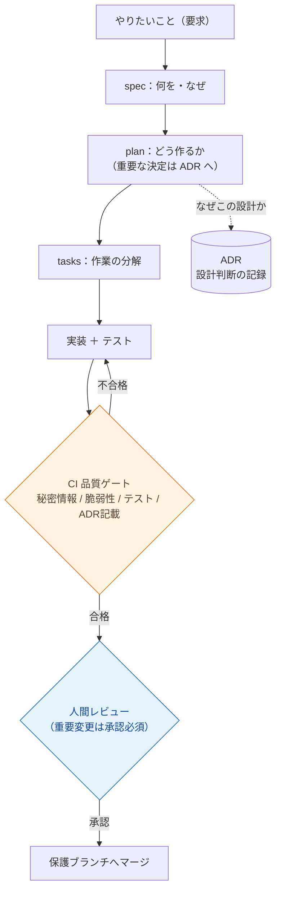

# AIエージェント開発テンプレート ドキュメント

> **AIエージェント（Claude / Codex / Gemini など）に、安全に・あとから追跡できる形でコードを書かせる**ためのプロジェクト雛形と、その**運用方法そのものを学ぶための教材**です。

このサイトは、上記テンプレートを **初めて見る人**（GitHub は使えるが AI 駆動開発は未経験、という方）が、

- これは **何なのか** を理解し、
- **なぜ必要か** ・ **何を解決するか** を腹落ちさせ、
- 実際に **導入** し、
- **自分のプロジェクトへ適用** し、
- 最終的に **ADR や SDD の思想** まで理解する

ところまで、最短距離で到達できるように設計されています。

[30分でまず体験する :material-rocket-launch:](getting-started/quickstart.md){ .md-button .md-button--primary }
[考え方から学ぶ :material-book-open-variant:](concepts/index.md){ .md-button }
[学習ロードマップを見る :material-map:](learning-path.md){ .md-button }

---

## このテンプレートは何を解決するのか

AIエージェントは速くコードを書けますが、**そのまま任せると次のことが起きがち**です。

- 1か月後、「なぜこの設計にしたのか」を誰も説明できない
- 要求・設計・実装が混ざった読みにくいドキュメントが量産される
- AI が本番データ・秘密情報・CI 設定にうっかり触れてしまう
- 「誰が・何を・なぜ承認したか」の記録が残らず、監査に答えられない

個人の試作なら許せても、**チーム開発・長期保守・規制業務では事故**になります。
このテンプレートは、AI に「**就業規則（ルール）＋承認ワークフロー＋記録の義務**」を与えることで、これを仕組みで防ぎます。

| 仕組みなし（よくある状態） | このテンプレート |
| --- | --- |
| 仕様なしで AI がいきなり実装 | **先に仕様（何を・なぜ）を書かせる**（[SDD](concepts/spec-driven-development.md)） |
| 設計理由が消える | **重要な決定は ADR に残す**（[ADR](concepts/adr.md)） |
| AI が何でも勝手にマージ | **重要変更は人間承認を必須**（[変更クラス](concepts/governance.md)で自動仕分け） |
| 危険な変更も素通り | **CI が秘密情報・脆弱性・テスト失敗を自動ブロック**（[品質ゲート](concepts/quality-gates.md)） |

---

## 全体像（3分で把握する）

このテンプレートの中心となる考え方は **3つだけ** です。

1. **仕様ファースト** — コードの前に「何を・なぜ」を書く。役割を分けて重複させない。
2. **変更クラスで仕分け** — 変更の重さを A/B/C/D に分類し、AI が単独でやってよいことと人間承認が要ることを自動で決める。
3. **CI ゲートで機械強制** — ルールは「書く」だけでなく、CI が通らないと止める。

> この流れは [spec-kit](concepts/spec-kit.md) のコマンド（`/speckit.specify` → `/speckit.plan` → `/speckit.tasks` → `/speckit.implement`）にそのまま対応します。

---

## このドキュメントの歩き方

| セクション | 何が学べるか | こんなときに |
| --- | --- | --- |
| [はじめに](getting-started/index.md) | 環境準備と **30分で動かす** 最短手順 | とにかくまず触ってみたい |
| [コンセプト](concepts/index.md) | AIDD / SDD / ADR / Constitution / Governance の **考え方** | 「なぜ必要か」を理解したい |
| [チュートリアル](tutorials/index.md) | プロジェクト作成 → ADR → Spec → 実装 → レビュー → 運用の **実践** | 手を動かして体得したい |
| [アーキテクチャ](architecture/index.md) | リポジトリ構造と文書の役割分担 | 全体の地図がほしい |
| [ガバナンス詳説](governance/index.md) | 変更管理・承認・段階導入・強制台帳の **深掘り** | チーム/組織へ展開したい |
| [実例で学ぶ](examples/index.md) | 同梱サンプル（spec/ADR）の読み解き | 良い書き方の手本がほしい |
| [リファレンス](reference/index.md) | [用語集](reference/glossary.md)・[文書マップ](reference/document-map.md)・[コマンド集](reference/commands.md) | 用語やコマンドを引きたい |
| [FAQ](faq.md) / [トラブルシューティング](troubleshooting.md) | よくある疑問・つまずき | 困ったとき |

---

## あなたはどのレベル？

このサイトは、次の 4 レベルの読者が **どこからでも始められる** ように作られています。各レベルの推奨ルートは [学習ロードマップ](learning-path.md) にまとめています。

| レベル | あなたの状態 | まず読むと良いページ |
| --- | --- | --- |
| **レベル1** | GitHub は使えるが、**AI 駆動開発は未経験** | [AI駆動開発（AIDD）](concepts/ai-driven-development.md) |
| **レベル2** | **Claude Code / spec-kit が未経験** | [spec-kit](concepts/spec-kit.md)・[Claude Code](concepts/multi-agent.md) |
| **レベル3** | **ADR / Architecture Governance が未経験** | [ADR](concepts/adr.md)・[ガバナンス](concepts/governance.md) |
| **レベル4** | **テンプレートリポジトリの運用が未経験** | [運用チュートリアル](tutorials/06-operate.md)・[ガバナンス詳説](governance/index.md) |

> **このテンプレートは「製品」ではなく「教材」でもあります。** 実行されるアプリのコードは含まれません（あなたのコードを足して使います）。
> 同梱の `specs/001-user-profile-export/` や `adr/adr-0000-...md` は、書き方の手本として残してある**サンプル**です。

---

## 次のステップ

- まず動かしたい → **[30分クイックスタート](getting-started/quickstart.md)**
- 順番に学びたい → **[学習ロードマップ（Day 1〜3）](learning-path.md)**
- 用語が分からない → **[用語集](reference/glossary.md)**
