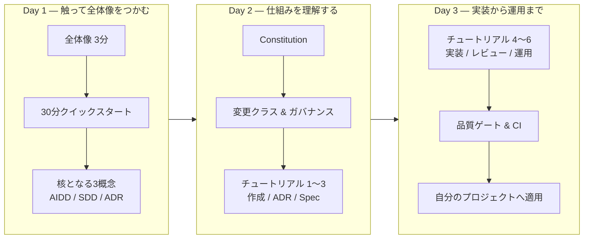

# 学習ロードマップ

このページは「**何を・どの順番で学ぶか**」の地図です。READ ME を分割しただけのドキュメントにならないよう、
**前提知識の少ない順** → **手を動かす** → **思想を理解する** の流れで設計しています。

> **読み方のコツ:** まず Day 1 を通しでやると「全体像 ＋ 成功体験」が手に入ります。
> Day 2・Day 3 は必要に応じて分割しても構いません。各ステップに **所要時間の目安** を付けました。

---

## Day 1 — 触って全体像をつかむ（合計 約90分）

**ゴール:** 「これが何で、なぜ要るか」を説明できる。テンプレートを 1 回動かして成功体験を得る。

| 順 | ステップ | ページ | 目安 |
| --- | --- | --- | --- |
| 1 | 全体像を 3 分で把握 | [ホーム](index.md) | 5分 |
| 2 | 環境を準備（Git / GitHub / AI エージェント） | [前提環境を整える](getting-started/prerequisites.md) | 20分 |
| 3 | **30分で 1 機能を作る成功体験** | [30分クイックスタート](getting-started/quickstart.md) | 30分 |
| 4 | なぜ「AI に書かせる前提」なのか | [AI駆動開発（AIDD）](concepts/ai-driven-development.md) | 15分 |
| 5 | なぜ「仕様ファースト」なのか | [仕様駆動開発（SDD）](concepts/spec-driven-development.md) | 15分 |

> **Day 1 終了時のチェック:** 「spec / plan / ADR の違いを一言で説明できる」「30分クイックスタートで `specs/` 配下に成果物ができた」。

---

## Day 2 — 仕組み（ガバナンス）を理解する（合計 約2.5時間）

**ゴール:** 「AI が単独でやってよいこと／人間承認が要ること」の線引きと、その根拠を理解する。

| 順 | ステップ | ページ | 目安 |
| --- | --- | --- | --- |
| 1 | 設計判断の記録 = ADR とは | [ADR（設計判断の記録）](concepts/adr.md) | 20分 |
| 2 | 最上位ルール = Constitution とは | [Constitution（開発憲章）](concepts/constitution.md) | 20分 |
| 3 | 変更クラス A/B/C/D と承認境界 | [ガバナンスと変更クラス](concepts/governance.md) | 25分 |
| 4 | spec-kit のコマンドフロー | [spec-kit](concepts/spec-kit.md) | 15分 |
| 5 | 実践: テンプレートからプロジェクト作成 | [チュートリアル1](tutorials/01-create-project.md) | 20分 |
| 6 | 実践: ADR を 1 本書く | [チュートリアル2](tutorials/02-write-adr.md) | 20分 |
| 7 | 実践: Spec を 1 本書く | [チュートリアル3](tutorials/03-write-spec.md) | 20分 |

> **Day 2 終了時のチェック:** 「自分の変更が Class A〜D のどれかを判定できる」「ADR を 1 本、Status とフロントマター付きで書ける」。

---

## Day 3 — 実装から運用まで（合計 約2.5時間）

**ゴール:** AI に実装させ、レビューし、CI ゲートを通し、**自分のプロジェクトへ適用** できる。

| 順 | ステップ | ページ | 目安 |
| --- | --- | --- | --- |
| 1 | 実践: Claude Code で実装 | [チュートリアル4](tutorials/04-implement.md) | 30分 |
| 2 | 実践: レビューと承認 | [チュートリアル5](tutorials/05-review.md) | 25分 |
| 3 | 品質ゲートの仕組み（`task verify`） | [品質ゲート](concepts/quality-gates.md) | 20分 |
| 4 | 複数 AI ツールの併用 | [マルチエージェントとClaude Code](concepts/multi-agent.md) | 15分 |
| 5 | 実践: 運用（リリース・障害・改正） | [チュートリアル6](tutorials/06-operate.md) | 25分 |
| 6 | **自分のプロジェクトへ導入** | [ガバナンス詳説](governance/index.md) の「段階導入」 | 20分 |

> **Day 3 終了時のチェック:** 「`task verify` が緑になる PR を出せる」「自組織に合う段階導入プロファイル（Lite/Standard/Regulated）を選べる」。

---

## 役割別のおすすめルート

全部を一度に学ぶ必要はありません。立場に応じて重点を変えてください。

### 個人開発者・小規模

最短で価値を得るルート。重い統治は後回しでも、絶対ルール（本番データを AI に渡さない等）は最初から守ります。

1. [30分クイックスタート](getting-started/quickstart.md)
2. [AIDD](concepts/ai-driven-development.md) → [SDD](concepts/spec-driven-development.md) → [ADR](concepts/adr.md)
3. [ガバナンス詳説](governance/index.md) の **Lite プロファイル** だけ採用

### チームリード・テックリード

AI と人間の責任分界点を設計する立場。変更クラスと承認マトリクスが要。

1. [Constitution](concepts/constitution.md) → [ガバナンス](concepts/governance.md)
2. [品質ゲート](concepts/quality-gates.md)（CI = ローカル = AI を一致させる）
3. [マルチエージェント運用](concepts/multi-agent.md)
4. [ガバナンス詳説](governance/index.md)（承認者・CODEOWNERS・段階導入）

### 規制業界・監査対応

「AI は本番データに触れない」「誰が何を承認したか」を構造的に保証する立場。

1. [Constitution](concepts/constitution.md)（RFC 2119・強制手段の三分類）
2. [ガバナンス詳説](governance/index.md)（強制台帳・Regulated プロファイル・Break-glass）
3. [ADR](concepts/adr.md)（監査証跡・不変性・Status 遷移）

---

## さらに深く

- 全文書の関係を俯瞰: [文書マップ](reference/document-map.md)
- 用語でつまずいたら: [用語集](reference/glossary.md)
- 同梱サンプルの読み解き: [実例で学ぶ](examples/index.md)
