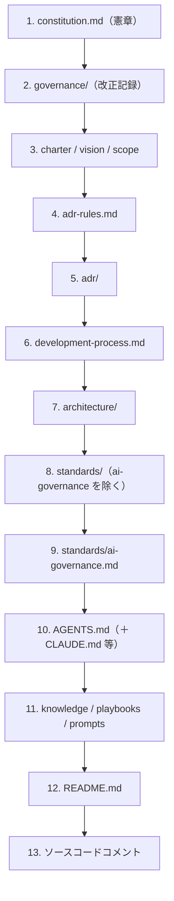

# 文書マップ

テンプレートには多くのファイルがありますが、**役割が明確に分かれています**。
ここは「どのファイルが何を担うか」「矛盾したらどれが勝つか」を引くための一覧です。

> **まず見るのは 4 つだけ:** `README.md` → `AGENTS.md` → `development-process.md` → `specs/001-.../`。
> 残りは「必要になったら見る参照資料」です。

## 文書管理階層（矛盾時の優先順位）

下位が上位と矛盾する場合、**上位が優先**します（MUST）。

## ルール・統治（最初に読む）

| 文書 | 役割 | 変更クラス |
| --- | --- | --- |
| `constitution.md` | 開発憲章（最上位ルール） | A |
| `.specify/memory/constitution.md` | 憲章の簡潔ビュー（ゲート判定用） | A |
| `AGENTS.md` | AI エージェント実行指示の入口（共通正本） | A |
| `CLAUDE.md` / `GEMINI.md` / `CODEX.md` / `OPENHANDS.md` / `TAKT.md` | 各 AI ツール向けの薄い委譲設定 | A |
| `agents/` | エージェント名簿・協調プロトコル | A |
| `SKILLS.md` | エージェント能力カタログ（→ `skills/`） | A |
| `development-process.md` | 変更クラス判定・承認・段階導入 | A |
| `standards/` | セキュリティ・テスト等の技術標準 | A |
| `governance/` | 改正記録・強制台帳・例外/適用除外/リスク | A |

## 作業する場所

| 文書 | 役割 | 変更クラス |
| --- | --- | --- |
| `specs/` | 機能ごとの spec / plan / tasks | C（spec は C/D） |
| `adr/` | 設計判断の記録 ＋ 自動索引 | B（accepted 化は A） |
| `architecture/` | アーキテクチャ（原則・境界・ケイパビリティ・C4・ドメイン・ロードマップ） | B |

## ADR 関連

| 文書 | 役割 |
| --- | --- |
| `adr-rules.md` | ADR 運用規則（命名・必須・Status）の正本 |
| `adr-template.md` | 記入様式（完全プロファイル） |
| `adr-template-minimal.md` | 記入様式（最小プロファイル） |
| `adr/adr-0000-...md` | ADR 運用自体の決定（実例・full） |
| `adr/INDEX.md` | フロントマターから自動生成された索引 |

## AI の知識・手順（任意・育てていく）

| 文書 | 役割 | 変更クラス |
| --- | --- | --- |
| `knowledge/` | AI 参照用の確定知識 | D（規範化したら昇格） |
| `memory/` | エージェント作業記憶（申し送り・反省・却下案） | D |
| `playbooks/` | 運用手順（リリース・障害対応 等） | C |
| `prompts/` | 再利用プロンプト資産（ライフサイクル統治） | C |
| `skills/` | 手順化した能力（`SKILLS.md` の実体） | C |
| `metrics/` | 計測（DORA・AI 有効性） | D |

## 設定・運用・強制

| 文書 | 役割 | 変更クラス |
| --- | --- | --- |
| `ADOPTION.md` | 採用時のセットアップ手順 | A |
| `.github/` | CI（品質ゲート）・CODEOWNERS・PR テンプレート | A |
| `Taskfile.yml` | 品質ゲートの統一入口 | A |
| `scripts/checks/` | 各チェックの実体 | A |
| `lefthook.yml` / `.mise.toml` | Git フック / ツールチェーン | A |
| `.markdownlint.jsonc` | Markdown Lint 設定 | （ゲート設定） |
| `glossary.md` | 製品ドメイン用語（ユビキタス言語） | D |

## 基本方針

| 文書 | 役割 |
| --- | --- |
| `charter.md` | プロジェクトの目的 |
| `vision.md` | ビジョン |
| `scope.md` | スコープ（やること・やらないこと） |

## このドキュメントサイト自体

| 文書 | 役割 | 変更クラス |
| --- | --- | --- |
| `docs/` | この学習用ドキュメント（MkDocs） | D |
| `mkdocs.yml` | サイト設定・ナビゲーション | C 相当 |
| `requirements-docs.txt` | サイトのビルド依存 | C/D |
| `.github/workflows/deploy-docs.yml` | Pages への自動デプロイ | **A**（`.github/**`） |

> このサイトをテンプレートへ追加すること自体が、変更クラスの良い実例です。詳細は [このサイトについて](../about/site-design.md)。

## 関連

- 優先順位の考え方: [Constitution](../concepts/constitution.md)
- レイヤで見る: [アーキテクチャ](../architecture/index.md)
- 用語: [用語集](glossary.md)
