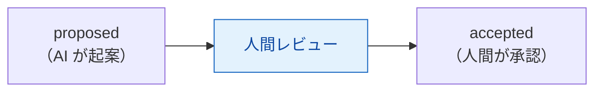

# チュートリアル2 — ADRを作成する

> **学習目標:** 1 つの設計判断を ADR として正しく起票できる。
> **読了後にできること:** フロントマターと必須セクションを備えた ADR を書き、`adr/INDEX.md` を再生成し、ゲートを通せる。
> **前提知識:** [ADR のコンセプト](../concepts/adr.md) を読了。

## 今回の決定

題材「タグ検索」で、**タグの保存・検索方式**を決めます。これは設計の根幹に関わるため ADR 化します。

- 選択肢 A: タグをカンマ区切りの 1 カラムに保存（実装が単純）
- 選択肢 B: タグを別テーブルに正規化（検索・集計に強い）
- 選択肢 C: 全文検索エンジンを導入（将来の拡張に強いが重い）

## ステップ 1 — 様式を選んでファイルを作る

学習なので **最小プロファイル**（`adr-template-minimal.md`）を使います。命名は `adr-NNNN-short-title.md`。

```bash
cp adr-template-minimal.md adr/adr-0001-tag-search-strategy.md
```

> 番号 `0000` は ADR 運用自体の決定（`adr-0000`）で予約済み。最初の実 ADR は `0001` から。

## ステップ 2 — フロントマターを書く（機械可読メタデータの正本）

```yaml
---
id: ADR-0001
title: タグ検索の保存・検索方式
status: proposed          # まずは proposed（承認は人間・Class A）
date: 2026-06-14
last_updated: 2026-06-14
profile: minimal
scope: project
proposer: "あなたの名前 / @bot/claude"
decision-makers: []        # accepted 時に記入
consulted: []
review_after: ""           # accepted 時に YYYY-MM-DD
depends_on: []
supersedes: []
superseded_by: []
relates_to: []
---
```

> **ポイント:** `decision-makers` と `review_after` は **accepted のときだけ非空**にします。
> proposed 段階で空でも検証は通ります（提案中に承認者は未確定だから）。

## ステップ 3 — 本文の必須セクションを埋める

最小プロファイルの共通必須セクションは以下です。

- `# ADR-0001: タグ検索の保存・検索方式`（H1）
- 変更履歴 / コンテキスト / 意思決定事項 / 選択肢 / 決定（案）/ 承認 / 結果

「選択肢」には A/B/C のメリット・デメリットを**客観的に**書き、「決定（案）」で採用案と
**却下した理由（トレードオフ）** を書きます。AI に下書きさせてよいですが、結論は決め打ちさせません。

## ステップ 4 — 索引を再生成する

ADR の一覧・関係グラフは `adr/INDEX.md` に**自動生成**されます。手で編集しません。

```bash
python scripts/generate_adr_index.py
```

## ステップ 5 — ゲートを通す

```bash
task verify:fast    # adr 命名・Status・frontmatter・markdown を検査
```

赤になったら、命名規則・Status 語彙・必須キーを見直します（[トラブルシューティング](../troubleshooting.md)）。

## このあとの承認（参考）

`status` を **accepted** にするのは **Class A・人間承認必須** の行為です。AI は起案（proposed）まで。
承認時に `decision-makers` と `review_after` を埋め、変更履歴に遷移を 1 行記録します。



## 確認

- [ ] `adr/adr-0001-tag-search-strategy.md` を命名規則どおり作成した
- [ ] フロントマター必須キーが揃っている（id/title/status/date/profile ほか）
- [ ] 選択肢に却下案とその理由が書かれている
- [ ] `python scripts/generate_adr_index.py` で索引が更新された
- [ ] `task verify:fast` が緑

## よくあるつまずき

- **命名でゲートが赤** → 正規表現 `^adr-[0-9]{4}-[a-z0-9]+(-[a-z0-9]+)*\.md$` に合わせる（小文字・ハイフン）。
- **Status が赤** → フロントマターの `status` は小文字（`proposed` 等）。
- **索引に差分** → `generate_adr_index.py` を実行し直してコミット。

## 次へ

「なぜこの設計か」を残せたら、「何を作るか」を書く → [チュートリアル3「仕様を作成する」](03-write-spec.md)
