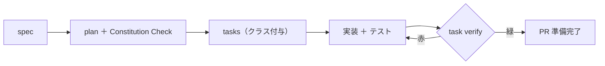

# チュートリアル4 — Claude Codeで実装する

> **学習目標:** spec から plan→tasks→実装へ進め、テストとゲートを通せる。
> **読了後にできること:** AI に実装を下書きさせ、`task verify` を緑にして PR 準備ができる。
> **前提知識:** [チュートリアル3](03-write-spec.md) 完了。[品質ゲート](../concepts/quality-gates.md) を一読。

## ステップ 1 — plan を書く（Constitution Check）

```text
/speckit.plan
```

`plan.md`（How）が作られ、**Constitution Check** が走ります。
今回はタグ検索 API の追加（公開IF）を含むため **Class B**。AI は plan の中で `ADR-0001` を参照します。

> Gate に違反したら、`plan.md` の Complexity Tracking に違反・正当化・却下した代替案を記録します。
> 正当化できない違反は設計をやり直します。

## ステップ 2 — tasks に分解する

```text
/speckit.tasks
```

各タスクに **変更クラス** と **承認要否** が付きます。例:

| タスク | クラス | 承認 |
| --- | --- | --- |
| タグ検索 API の追加（公開IF） | B | 人間承認＋原則 ADR |
| 認可（自分のメモのみ）の実装 | A 相当 | 人間承認必須 |
| 単体テストの追加 | C | 人間がマージ承認 |
| README へ使い方追記 | D | ゲート通過で自己反映可 |

> **認可は Class A 相当**（セキュリティ）。「自分のデータのみ」は機能の中核なので慎重に。

## ステップ 3 — 実装する

```text
/speckit.implement
```

AI がコードとテストを下書きします。ここで守ること:

- **テストを必ず伴わせる**（FR-1〜3 を検証する単体テスト）。
- **ドキュメントだけで終わらせない**（doc-churn 回避。各反復でコード/テストを前進）。
- **本番データを使わない**。テストは**合成データ**で（個人データを AI に渡さない）。

## ステップ 4 — 品質ゲートを通す

```bash
task verify     # CI と同一の包括チェック（build/test/secret/deps/links/...）
```

赤になったら **原因側を直します**（ゲートを緩めない）。型エラー・テスト失敗・秘密情報混入・リンク切れなどを潰します。



## 確認

- [ ] `plan.md` ができ、Constitution Check を通過/記録した
- [ ] `tasks.md` の各タスクにクラスが付いた
- [ ] FR を検証するテストがある
- [ ] テストは合成データ（本番データを使っていない）
- [ ] `task verify` が緑

## よくあるつまずき

- **AI がいきなりコードを書き始める** → 先に plan/tasks を求める。spec に立ち返る。
- **カバレッジで赤** → `standards/testing-standards.md` の閾値を満たすテストを追加。
- **secret スキャンで赤** → ハードコードした鍵を環境変数へ。`.env` は `.gitignore` 済み。

## 次へ

実装ができたら、人間の目を通す → [チュートリアル5「レビューする」](05-review.md)
