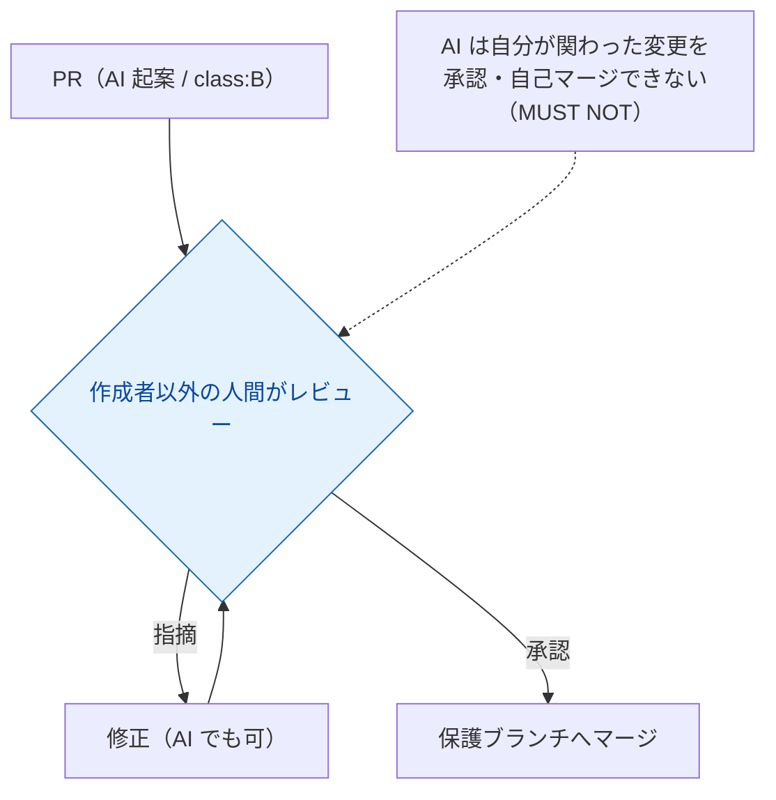

# チュートリアル5 — レビューする

> **学習目標:** AI が起案した変更を、クラスに応じて正しくレビュー・承認できる。
> **読了後にできること:** ラベル付け・承認境界・DoD 確認を運用できる。
> **前提知識:** [ガバナンスと変更クラス](../concepts/governance.md) を読了。

## ステップ 1 — PR を出す（監査証跡を残す）

作業ブランチから PR を作成します。AI が起案した変更は、**AI 由来だと分かるように**します。

- コミットトレーラ: `Assisted-by: @bot/claude`（または `Co-Authored-By:`）
- PR ラベル:
  - `ai-generated` … AI が起案
  - `class:A` / `class:B` / `class:C` / `class:D` … 変更クラス
  - `permission-impact` … 統治・強制機構に触れる場合（CODEOWNERS 承認必須）
  - `adr-required` … 内容トリガで ADR が要る場合

今回のタグ検索は公開IF追加なので **`class:B`**、認可を含むため一部 **Class A 相当**。

## ステップ 2 — 承認境界を確認する（作成者 ≠ 承認者）

- **Class A/B は人間承認必須。** AI は起案のみで、**自己マージ禁止**。
- 統治・強制機構に触れるなら **CODEOWNERS の承認**も必須。
- Class D（統治文書を除く）は、ドキュメントゲート全通過なら AI 自己反映が許される場合あり。

## ステップ 3 — 完了条件（DoD）をチェックする

マージ前に、憲章「9. 完了条件」に沿って確認します。

- [ ] 品質ゲート（build/型/テスト/カバレッジ/secret/脆弱性）を通過（`task verify` 緑）
- [ ] Class A/B を含むので、ADR 参照（`ADR-0001`）または「ADR 不要理由」が PR に記載
- [ ] spec と実装が整合（乖離があれば実装か spec を直す）
- [ ] 関連ドキュメント更新（必要なら `AGENTS.md` / `standards/ai-governance.md`）
- [ ] 監査証跡（作成者・承認者・根拠）が追える
- [ ] 重大な性能劣化がない

## ステップ 4 — レビュー観点（何を見るか）

| 観点 | 見るポイント |
| --- | --- |
| 仕様適合 | FR-1〜3 を満たすか。非ゴールに踏み込んでいないか |
| セキュリティ | 認可（自分のメモのみ）が正しいか。秘密情報・本番データを使っていないか |
| 設計整合 | ADR-0001 の決定に沿っているか。憲章/ADR と矛盾しないか |
| クラス判定 | ラベルのクラスが妥当か（内容トリガで引き上げ要否） |
| テスト | 受け入れ基準を検証しているか。合成データか |

## 確認

- [ ] PR に `ai-generated` と `class:*` ラベルが付いた
- [ ] 作成者以外の人間が承認した
- [ ] DoD チェックを満たした
- [ ] （該当時）CODEOWNERS が承認した

## よくあるつまずき

- **AI が自分でマージしようとする** → 禁止。作成者≠承認者を徹底（ブランチ保護で機械強制）。
- **ADR 記載漏れで CI が赤** → PR に ADR 参照か「不要理由」を明記。
- **クラスの付け間違い** → 内容トリガ（公開API/スキーマ/認可/外部依存/不可逆）を確認し引き上げる。

## 次へ

マージできたら、その先の運用へ → [チュートリアル6「運用する」](06-operate.md)
