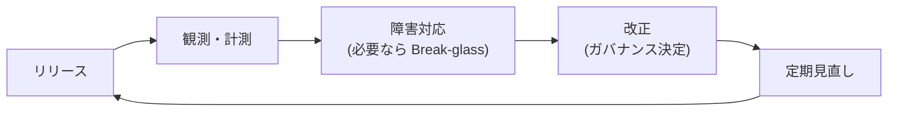
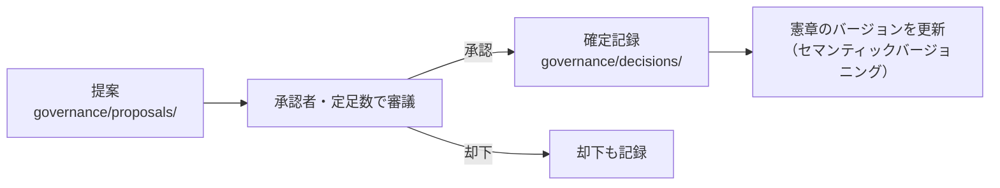

# チュートリアル6 — 運用する

> **学習目標:** 機能を 1 つ作った先の「継続運用」の全体像をつかむ。
> **読了後にできること:** リリース・障害対応・改正・計測の進め方を説明できる。
> **前提知識:** チュートリアル1〜5 を完了。

機能を作って終わりではありません。テンプレートは**長期運用**まで面倒を見ます。

## 1. リリース

リリースは **Class A**（本番への反映）。手順は `playbooks/release.md` を正本にします。

- `task verify` が緑であること、必要な承認が揃っていることを確認。
- リリースは**ロールバック手段**を備える（可逆性。憲章の原則）。
- 監査証跡（誰が承認したか）を残す。

## 2. 障害対応と Break-glass（緊急時例外）

障害手順は `playbooks/incident-response.md`。本番障害などの緊急時に限り、**Break-glass** が使えます。

- 事前検証を**事後検証へ切り替えてよい**（MAY）が、**人間（緊急承認者）の承認は免除されない**。
- 適用したら、事実・理由・範囲・承認者を記録し、**72 時間以内に事後レビュー**（スキップしたゲートの事後実行を含む）を完了する（MUST）。
- Break-glass を**恒久的な統治の緩和**に使ってはいけません。

## 3. 改正は「ガバナンス決定」

運用していると、ルール自体を変えたくなります。**憲章・統治機構の変更は ADR ではなくガバナンス決定**です。

- **AI は単独で承認・反映できません**（MUST NOT）。
- プロファイル変更（Lite↔Standard↔Regulated）も**ガバナンス決定として記録**します。
- 例外・適用除外・リスクは `governance/exceptions/` `waivers/` `risk-register/` に台帳化。

## 4. 定期見直し

憲章と統治・強制機構は、**少なくとも 6 か月ごと**、または重大インシデントの事後レビュー時に見直します。

- 「変更不要」でも、**見直した記録**を残します。
- 強制台帳（`governance/enforcement-ledger.md`）の網羅性（すべての MUST に強制手段が割り当たっているか）を確認。

## 5. 依存の継続保守

- Renovate / Dependabot で依存を自動更新（`.github/dependabot.yml`）。
- 既知の重大脆弱性を含む依存はマージしない（`task verify` の deps チェック）。
- 依存の**新規追加・メジャー更新**は Class A（人間承認）。

## 6. 計測（うまくいっているか）

`metrics/` で開発の健全性を測ります。

- **DORA**（`metrics/dora.md`）: デプロイ頻度・変更リードタイム・変更失敗率・復旧時間。
- **AI 有効性**（`metrics/ai-metrics.md`）: AI 起案の採用率・手戻り率など。

> 計測は「監査証跡が機能しているか」「ガバナンスが速度を不当に落としていないか」を点検する material です。

## 確認

- [ ] リリース/障害の手順（playbooks）の場所を把握した
- [ ] Break-glass の制約（人間承認は免除されない・72時間以内に事後レビュー）を説明できる
- [ ] 憲章改正がガバナンス決定であり AI 単独不可だと理解した
- [ ] 定期見直しと計測の存在を把握した

## おめでとうございます

これでテンプレートの **作成 → 設計記録 → 仕様 → 実装 → レビュー → 運用** を一周しました。

次のステップ:

- 自組織へ本格導入する → [ガバナンス詳説](../governance/index.md)
- 同梱サンプルをさらに読む → [実例で学ぶ](../examples/index.md)
- 困ったら → [FAQ](../faq.md) / [トラブルシューティング](../troubleshooting.md)
